# ksproxy logic in diagrams

This document draws the complete logic of ksproxy as Mermaid diagrams, as the code is today. Part 1 follows the flows that cross modules: one tool call, `ksproxy start` up to READY, shutdown, a stale session, the health check, the MCP message loop and the life of a session. Part 2 has one section per source file, with diagrams that cover every exported function and every decision inside it.

How to read the diagrams:

- Flowcharts run top to bottom in the order the code checks things. A diamond is a check; the first check that fails decides the outcome.
- `REFUSE:` starts a refusal, followed by the short reason the code returns (the `short` field, which the log prints in brackets). `ALLOW` and `OK` start successful outcomes. `ERROR:` is a thrown error, `FAIL:` a target that could not be opened.
- Labels cannot contain double quotes, so a double quote inside a reason is drawn as a single quote: `REFUSE: contains '..'` stands for the short reason `contains ".."`. Words in capitals (NAME, PORT, FLAG, CWD) are placeholders for the actual value. Angle brackets, braces, pipes and the number sign are described in words.
- When the code refers to a function in another module, the label names it; its own diagram is in that module's section.

`test/logic-docs.test.js` keeps this document complete: it fails when a file under `src/` or `bin/` has no section here, when an exported name is missing from its file's section, when a section names a file that no longer exists, or when a diagram breaks the syntax rules these diagrams follow.

# PART 1: Flows across modules

## 1. One tool call, from the agent to a target and back

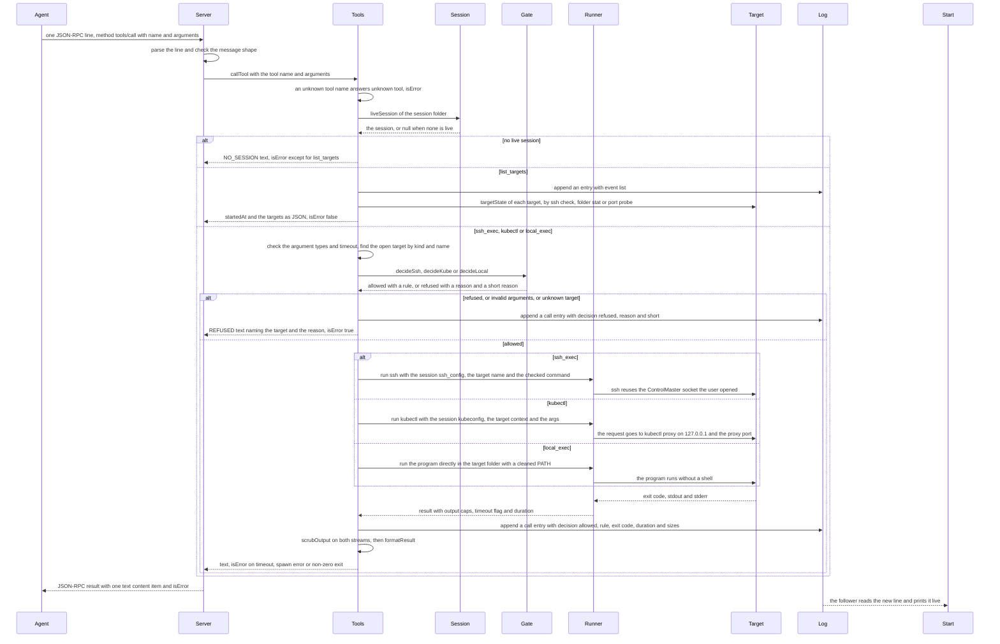
```mermaid
sequenceDiagram
    participant Agent
    participant Server
    participant Tools
    participant Session
    participant Gate
    participant Runner
    participant Target
    participant Log
    participant Start
    Agent->>Server: one JSON-RPC line, method tools/call with name and arguments
    Server->>Server: parse the line and check the message shape
    Server->>Tools: callTool with the tool name and arguments
    Tools->>Tools: an unknown tool name answers unknown tool, isError
    Tools->>Session: liveSession of the session folder
    Session-->>Tools: the session, or null when none is live
    alt no live session
        Tools-->>Server: NO_SESSION text, isError except for list_targets
    else list_targets
        Tools->>Log: append an entry with event list
        Tools->>Target: targetState of each target, by ssh check, folder stat or port probe
        Tools-->>Server: startedAt and the targets as JSON, isError false
    else ssh_exec, kubectl or local_exec
        Tools->>Tools: check the argument types and timeout, find the open target by kind and name
        Tools->>Gate: decideSsh, decideKube or decideLocal
        Gate-->>Tools: allowed with a rule, or refused with a reason and a short reason
        alt refused, or invalid arguments, or unknown target
            Tools->>Log: append a call entry with decision refused, reason and short
            Tools-->>Server: REFUSED text naming the target and the reason, isError true
        else allowed
            alt ssh_exec
                Tools->>Runner: run ssh with the session ssh_config, the target name and the checked command
                Runner->>Target: ssh reuses the ControlMaster socket the user opened
            else kubectl
                Tools->>Runner: run kubectl with the session kubeconfig, the target context and the args
                Runner->>Target: the request goes to kubectl proxy on 127.0.0.1 and the proxy port
            else local_exec
                Tools->>Runner: run the program directly in the target folder with a cleaned PATH
                Runner->>Target: the program runs without a shell
            end
            Target-->>Runner: exit code, stdout and stderr
            Runner-->>Tools: result with output caps, timeout flag and duration
            Tools->>Log: append a call entry with decision allowed, rule, exit code, duration and sizes
            Tools->>Tools: scrubOutput on both streams, then formatResult
            Tools-->>Server: text, isError on timeout, spawn error or non-zero exit
        end
    end
    Server-->>Agent: JSON-RPC result with one text content item and isError
    Log-->>Start: the follower reads the new line and prints it live
```

## 2. ksproxy start, from launch to READY

### 2a. Inventory, existing session, selection

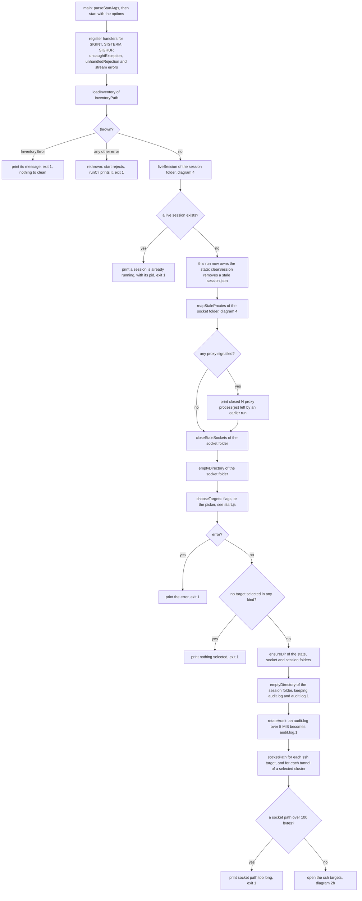
```mermaid
flowchart TD
    A1["main: parseStartArgs, then start with the options"] --> A2["register handlers for SIGINT, SIGTERM, SIGHUP,<br/>uncaughtException, unhandledRejection and stream errors"]
    A2 --> A3["loadInventory of inventoryPath"]
    A3 --> A4{"thrown?"}
    A4 -->|"InventoryError"| A5["print its message, exit 1, nothing to clean"]
    A4 -->|"any other error"| A6["rethrown: start rejects, runCli prints it, exit 1"]
    A4 -->|"no"| A7["liveSession of the session folder, diagram 4"]
    A7 --> A8{"a live session exists?"}
    A8 -->|"yes"| A9["print a session is already running, with its pid, exit 1"]
    A8 -->|"no"| A10["this run now owns the state: clearSession removes a stale session.json"]
    A10 --> A11["reapStaleProxies of the socket folder, diagram 4"]
    A11 --> A12{"any proxy signalled?"}
    A12 -->|"yes"| A13["print closed N proxy process(es) left by an earlier run"]
    A12 -->|"no"| A14["closeStaleSockets of the socket folder"]
    A13 --> A14
    A14 --> A15["emptyDirectory of the socket folder"]
    A15 --> A16["chooseTargets: flags, or the picker, see start.js"]
    A16 --> A17{"error?"}
    A17 -->|"yes"| A18["print the error, exit 1"]
    A17 -->|"no"| A19{"no target selected in any kind?"}
    A19 -->|"yes"| A20["print nothing selected, exit 1"]
    A19 -->|"no"| A21["ensureDir of the state, socket and session folders"]
    A21 --> A22["emptyDirectory of the session folder, keeping audit.log and audit.log.1"]
    A22 --> A23["rotateAudit: an audit.log over 5 MiB becomes audit.log.1"]
    A23 --> A24["socketPath for each ssh target, and for each tunnel of a selected cluster"]
    A24 --> A25{"a socket path over 100 bytes?"}
    A25 -->|"yes"| A26["print socket path too long, exit 1"]
    A25 -->|"no"| A27["open the ssh targets, diagram 2b"]
```

### 2b. Opening ssh targets, then Kubernetes targets

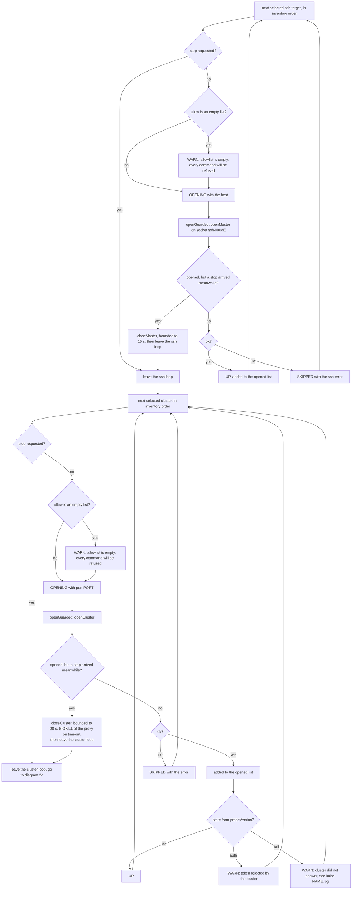
```mermaid
flowchart TD
    B1["next selected ssh target, in inventory order"] --> B2{"stop requested?"}
    B2 -->|"yes"| B30["leave the ssh loop"]
    B2 -->|"no"| B3{"allow is an empty list?"}
    B3 -->|"yes"| B4["WARN: allowlist is empty, every command will be refused"]
    B3 -->|"no"| B5["OPENING with the host"]
    B4 --> B5
    B5 --> B6["openGuarded: openMaster on socket ssh-NAME"]
    B6 --> B7{"opened, but a stop arrived meanwhile?"}
    B7 -->|"yes"| B8["closeMaster, bounded to 15 s, then leave the ssh loop"]
    B7 -->|"no"| B9{"ok?"}
    B9 -->|"yes"| B10["UP, added to the opened list"]
    B9 -->|"no"| B11["SKIPPED with the ssh error"]
    B10 --> B1
    B11 --> B1
    B8 --> B30
    B30 --> K1["next selected cluster, in inventory order"]
    K1 --> K2{"stop requested?"}
    K2 -->|"yes"| K30["leave the cluster loop, go to diagram 2c"]
    K2 -->|"no"| K3{"allow is an empty list?"}
    K3 -->|"yes"| K4["WARN: allowlist is empty, every command will be refused"]
    K3 -->|"no"| K5["OPENING with port PORT"]
    K4 --> K5
    K5 --> K6["openGuarded: openCluster"]
    K6 --> K7{"opened, but a stop arrived meanwhile?"}
    K7 -->|"yes"| K8["closeCluster, bounded to 20 s, SIGKILL of the proxy on timeout,<br/>then leave the cluster loop"]
    K7 -->|"no"| K9{"ok?"}
    K9 -->|"yes"| K10["added to the opened list"]
    K9 -->|"no"| K11["SKIPPED with the error"]
    K10 --> K12{"state from probeVersion?"}
    K12 -->|"up"| K13["UP"]
    K12 -->|"auth"| K14["WARN: token rejected by the cluster"]
    K12 -->|"fail"| K15["WARN: cluster did not answer, see kube-NAME.log"]
    K13 --> K1
    K14 --> K1
    K15 --> K1
    K11 --> K1
    K8 --> K30
```

### 2c. Opening local targets, then the checks before writing

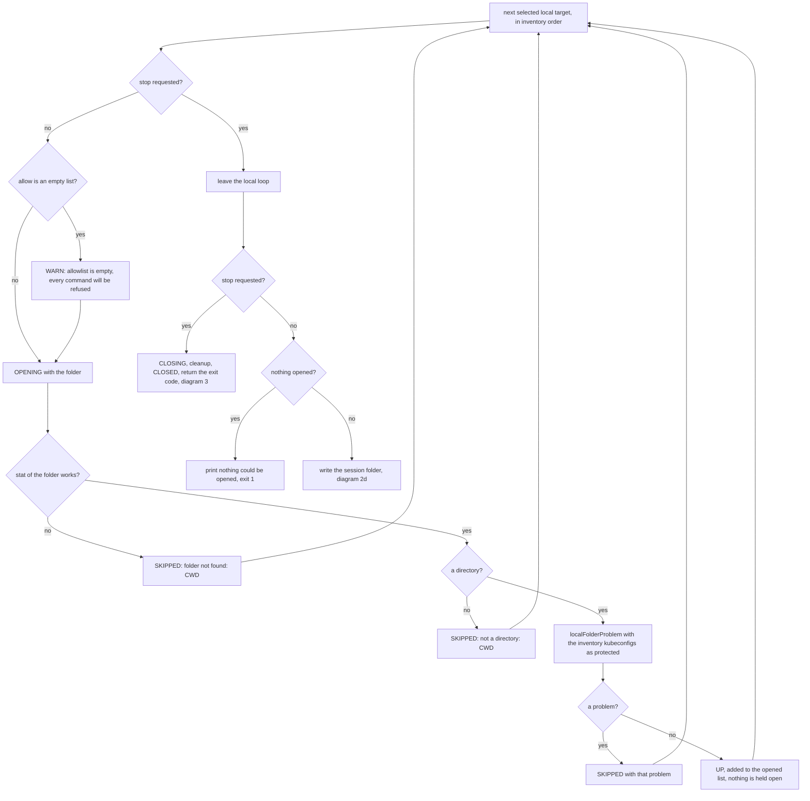
```mermaid
flowchart TD
    L1["next selected local target, in inventory order"] --> L2{"stop requested?"}
    L2 -->|"yes"| L30["leave the local loop"]
    L2 -->|"no"| L3{"allow is an empty list?"}
    L3 -->|"yes"| L4["WARN: allowlist is empty, every command will be refused"]
    L3 -->|"no"| L5["OPENING with the folder"]
    L4 --> L5
    L5 --> L6{"stat of the folder works?"}
    L6 -->|"no"| L7["SKIPPED: folder not found: CWD"]
    L6 -->|"yes"| L8{"a directory?"}
    L8 -->|"no"| L9["SKIPPED: not a directory: CWD"]
    L8 -->|"yes"| L10["localFolderProblem with the inventory kubeconfigs as protected"]
    L10 --> L11{"a problem?"}
    L11 -->|"yes"| L12["SKIPPED with that problem"]
    L11 -->|"no"| L13["UP, added to the opened list, nothing is held open"]
    L7 --> L1
    L9 --> L1
    L12 --> L1
    L13 --> L1
    L30 --> C1{"stop requested?"}
    C1 -->|"yes"| C2["CLOSING, cleanup, CLOSED, return the exit code, diagram 3"]
    C1 -->|"no"| C3{"nothing opened?"}
    C3 -->|"yes"| C4["print nothing could be opened, exit 1"]
    C3 -->|"no"| C5["write the session folder, diagram 2d"]
```

### 2d. Writing the session folder, the summary, READY

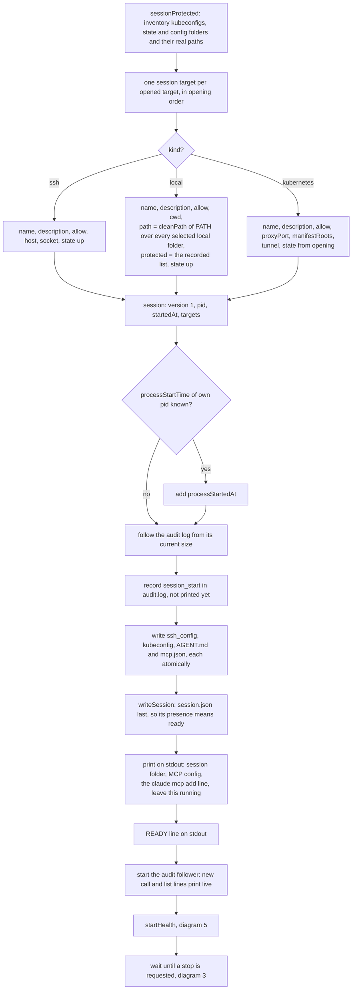
```mermaid
flowchart TD
    W1["sessionProtected: inventory kubeconfigs, state and config folders and their real paths"] --> W2["one session target per opened target, in opening order"]
    W2 --> W3{"kind?"}
    W3 -->|"ssh"| W4["name, description, allow, host, socket, state up"]
    W3 -->|"local"| W5["name, description, allow, cwd,<br/>path = cleanPath of PATH over every selected local folder,<br/>protected = the recorded list, state up"]
    W3 -->|"kubernetes"| W6["name, description, allow, proxyPort, manifestRoots,<br/>tunnel, state from opening"]
    W4 --> W7["session: version 1, pid, startedAt, targets"]
    W5 --> W7
    W6 --> W7
    W7 --> W8{"processStartTime of own pid known?"}
    W8 -->|"yes"| W9["add processStartedAt"]
    W8 -->|"no"| W10["follow the audit log from its current size"]
    W9 --> W10
    W10 --> W11["record session_start in audit.log, not printed yet"]
    W11 --> W12["write ssh_config, kubeconfig, AGENT.md and mcp.json, each atomically"]
    W12 --> W13["writeSession: session.json last, so its presence means ready"]
    W13 --> W14["print on stdout: session folder, MCP config,<br/>the claude mcp add line, leave this running"]
    W14 --> W15["READY line on stdout"]
    W15 --> W16["start the audit follower: new call and list lines print live"]
    W16 --> W17["startHealth, diagram 5"]
    W17 --> W18["wait until a stop is requested, diagram 3"]
```

## 3. Shutdown and clean-up

### 3a. What triggers a stop

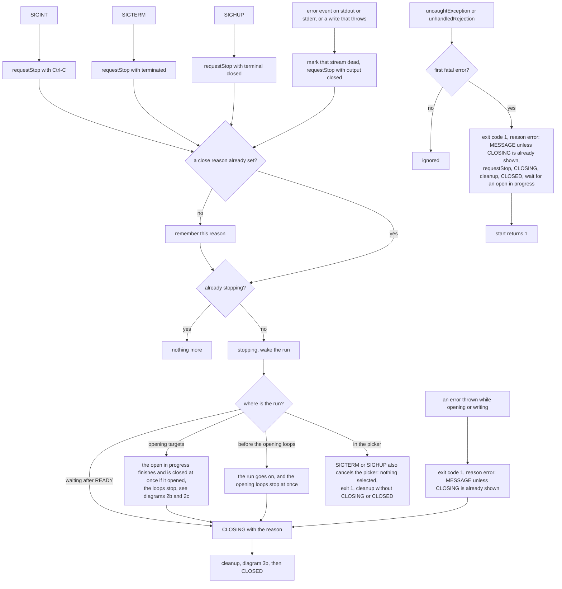
```mermaid
flowchart TD
    T1["SIGINT"] --> R1["requestStop with Ctrl-C"]
    T2["SIGTERM"] --> R2["requestStop with terminated"]
    T3["SIGHUP"] --> R3["requestStop with terminal closed"]
    T4["error event on stdout or stderr, or a write that throws"] --> R4["mark that stream dead, requestStop with output closed"]
    R1 --> RS{"a close reason already set?"}
    R2 --> RS
    R3 --> RS
    R4 --> RS
    RS -->|"no"| RS1["remember this reason"]
    RS -->|"yes"| RS2{"already stopping?"}
    RS1 --> RS2
    RS2 -->|"yes"| RS3["nothing more"]
    RS2 -->|"no"| RS4["stopping, wake the run"]
    RS4 --> WH{"where is the run?"}
    WH -->|"waiting after READY"| CL1["CLOSING with the reason"]
    WH -->|"opening targets"| WO["the open in progress finishes and is closed at once if it opened,<br/>the loops stop, see diagrams 2b and 2c"]
    WH -->|"before the opening loops"| WB["the run goes on, and the opening loops stop at once"]
    WH -->|"in the picker"| WP["SIGTERM or SIGHUP also cancels the picker: nothing selected,<br/>exit 1, cleanup without CLOSING or CLOSED"]
    WO --> CL1
    WB --> CL1
    F1["uncaughtException or unhandledRejection"] --> F2{"first fatal error?"}
    F2 -->|"no"| F3["ignored"]
    F2 -->|"yes"| F4["exit code 1, reason error: MESSAGE unless CLOSING is already shown,<br/>requestStop, CLOSING, cleanup, CLOSED, wait for an open in progress"]
    F4 --> F5["start returns 1"]
    E1["an error thrown while opening or writing"] --> E2["exit code 1, reason error: MESSAGE unless CLOSING is already shown"]
    E2 --> CL1
    CL1 --> CL2["cleanup, diagram 3b, then CLOSED"]
```

### 3b. Clean-up, in order

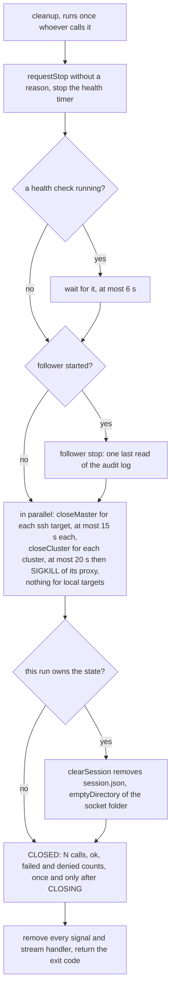
```mermaid
flowchart TD
    K1["cleanup, runs once whoever calls it"] --> K2["requestStop without a reason, stop the health timer"]
    K2 --> K3{"a health check running?"}
    K3 -->|"yes"| K4["wait for it, at most 6 s"]
    K3 -->|"no"| K5{"follower started?"}
    K4 --> K5
    K5 -->|"yes"| K6["follower stop: one last read of the audit log"]
    K5 -->|"no"| K7["in parallel: closeMaster for each ssh target, at most 15 s each,<br/>closeCluster for each cluster, at most 20 s then SIGKILL of its proxy,<br/>nothing for local targets"]
    K6 --> K7
    K7 --> K8{"this run owns the state?"}
    K8 -->|"no"| K10["CLOSED: N calls, ok, failed and denied counts, once and only after CLOSING"]
    K8 -->|"yes"| K9["clearSession removes session.json, emptyDirectory of the socket folder"]
    K9 --> K10
    K10 --> K11["remove every signal and stream handler, return the exit code"]
```

An exit before READY that is not caused by a stop (an inventory error, an existing session, nothing selected, a socket path too long, nothing opened) also runs cleanup, but prints no CLOSING or CLOSED line.

## 4. A stale session left by a killed run

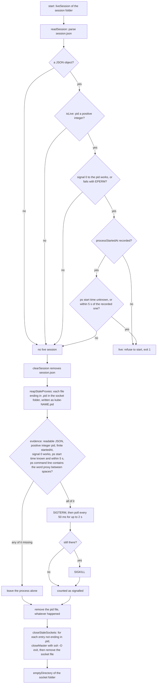
```mermaid
flowchart TD
    S1["start: liveSession of the session folder"] --> S2["readSession: parse session.json"]
    S2 --> S3{"a JSON object?"}
    S3 -->|"no"| S20["no live session"]
    S3 -->|"yes"| S4{"isLive: pid a positive integer?"}
    S4 -->|"no"| S20
    S4 -->|"yes"| S5{"signal 0 to the pid works, or fails with EPERM?"}
    S5 -->|"no"| S20
    S5 -->|"yes"| S6{"processStartedAt recorded?"}
    S6 -->|"no"| S21["live: refuse to start, exit 1"]
    S6 -->|"yes"| S7{"ps start time unknown, or within 5 s of the recorded one?"}
    S7 -->|"yes"| S21
    S7 -->|"no"| S20
    S20 --> S8["clearSession removes session.json"]
    S8 --> S9["reapStaleProxies: each file ending in .pid in the socket folder, written as kube-NAME.pid"]
    S9 --> S10{"evidence: readable JSON, positive integer pid, finite startedAt,<br/>signal 0 works, ps start time known and within 5 s,<br/>ps command line contains the word proxy between spaces?"}
    S10 -->|"any of it missing"| S13["leave the process alone"]
    S10 -->|"all of it"| S11["SIGTERM, then poll every 50 ms for up to 2 s"]
    S11 --> S12{"still there?"}
    S12 -->|"yes"| S14["SIGKILL"]
    S12 -->|"no"| S15["counted as signalled"]
    S14 --> S15
    S13 --> S16["remove the pid file, whatever happened"]
    S15 --> S16
    S16 --> S17["closeStaleSockets: for each entry not ending in .pid,<br/>closeMaster with ssh -O exit, then remove the socket file"]
    S17 --> S18["emptyDirectory of the socket folder"]
```

## 5. Health check loop, DOWN and UP

### 5a. The loop

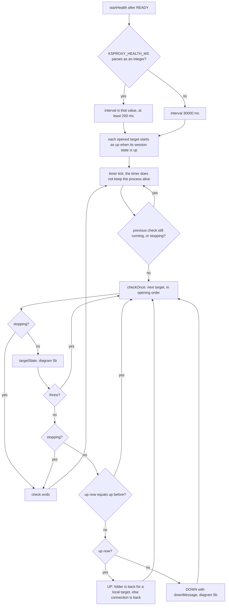
```mermaid
flowchart TD
    H1["startHealth after READY"] --> H2{"KSPROXY_HEALTH_MS parses as an integer?"}
    H2 -->|"yes"| H3["interval is that value, at least 200 ms"]
    H2 -->|"no"| H4["interval 30000 ms"]
    H3 --> H5["each opened target starts as up when its session state is up"]
    H4 --> H5
    H5 --> H6["timer tick, the timer does not keep the process alive"]
    H6 --> H7{"previous check still running, or stopping?"}
    H7 -->|"yes"| H6
    H7 -->|"no"| H8["checkOnce: next target, in opening order"]
    H8 --> H9{"stopping?"}
    H9 -->|"yes"| H20["check ends"]
    H9 -->|"no"| H10["targetState, diagram 5b"]
    H10 --> H11{"threw?"}
    H11 -->|"yes"| H8
    H11 -->|"no"| H12{"stopping?"}
    H12 -->|"yes"| H20
    H12 -->|"no"| H13{"up now equals up before?"}
    H13 -->|"yes"| H8
    H13 -->|"no"| H14{"up now?"}
    H14 -->|"yes"| H15["UP: folder is back for a local target, else connection is back"]
    H14 -->|"no"| H16["DOWN with downMessage, diagram 5b"]
    H15 --> H8
    H16 --> H8
    H20 --> H6
```

### 5b. Target state and the DOWN message

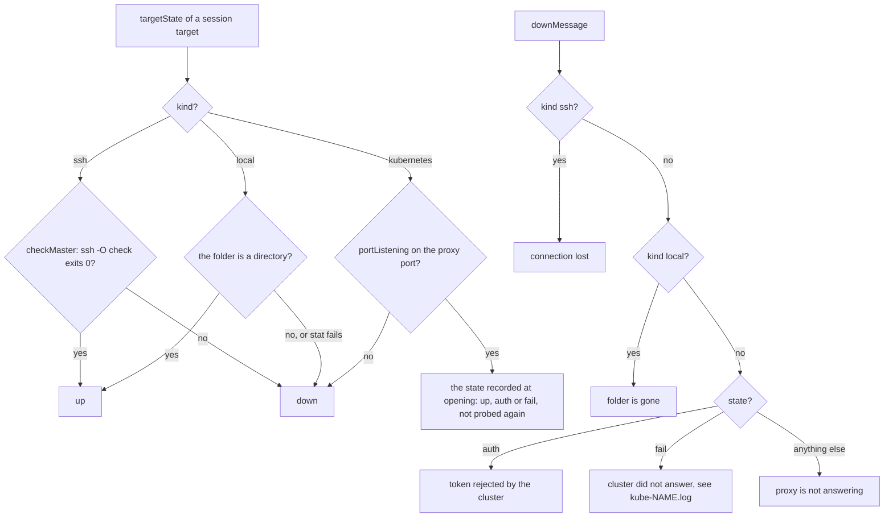
```mermaid
flowchart TD
    G1["targetState of a session target"] --> G2{"kind?"}
    G2 -->|"ssh"| G3{"checkMaster: ssh -O check exits 0?"}
    G3 -->|"yes"| G10["up"]
    G3 -->|"no"| G11["down"]
    G2 -->|"local"| G4{"the folder is a directory?"}
    G4 -->|"yes"| G10
    G4 -->|"no, or stat fails"| G11
    G2 -->|"kubernetes"| G5{"portListening on the proxy port?"}
    G5 -->|"no"| G11
    G5 -->|"yes"| G6["the state recorded at opening: up, auth or fail, not probed again"]
    D1["downMessage"] --> D2{"kind ssh?"}
    D2 -->|"yes"| D3["connection lost"]
    D2 -->|"no"| D4{"kind local?"}
    D4 -->|"yes"| D5["folder is gone"]
    D4 -->|"no"| D6{"state?"}
    D6 -->|"auth"| D7["token rejected by the cluster"]
    D6 -->|"fail"| D8["cluster did not answer, see kube-NAME.log"]
    D6 -->|"anything else"| D9["proxy is not answering"]
```

## 6. The MCP message loop

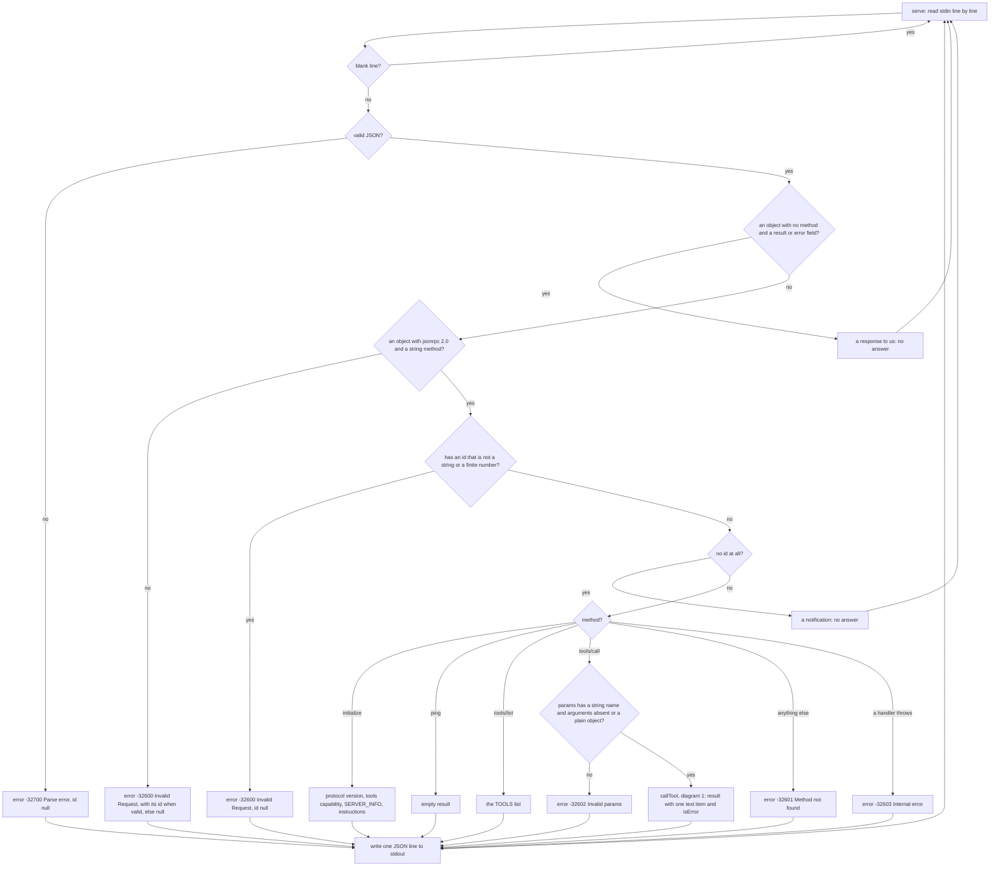
```mermaid
flowchart TD
    M1["serve: read stdin line by line"] --> M2{"blank line?"}
    M2 -->|"yes"| M1
    M2 -->|"no"| M3{"valid JSON?"}
    M3 -->|"no"| M4["error -32700 Parse error, id null"]
    M3 -->|"yes"| M5{"an object with no method and a result or error field?"}
    M5 -->|"yes"| M6["a response to us: no answer"]
    M5 -->|"no"| M7{"an object with jsonrpc 2.0 and a string method?"}
    M7 -->|"no"| M8["error -32600 Invalid Request, with its id when valid, else null"]
    M7 -->|"yes"| M9{"has an id that is not a string or a finite number?"}
    M9 -->|"yes"| M10["error -32600 Invalid Request, id null"]
    M9 -->|"no"| M11{"no id at all?"}
    M11 -->|"yes"| M12["a notification: no answer"]
    M11 -->|"no"| M13{"method?"}
    M13 -->|"initialize"| M14["protocol version, tools capability, SERVER_INFO, instructions"]
    M13 -->|"ping"| M15["empty result"]
    M13 -->|"tools/list"| M16["the TOOLS list"]
    M13 -->|"tools/call"| M17{"params has a string name and arguments absent or a plain object?"}
    M17 -->|"no"| M18["error -32602 Invalid params"]
    M17 -->|"yes"| M19["callTool, diagram 1: result with one text item and isError"]
    M13 -->|"anything else"| M20["error -32601 Method not found"]
    M14 --> M21["write one JSON line to stdout"]
    M15 --> M21
    M16 --> M21
    M18 --> M21
    M19 --> M21
    M20 --> M21
    M4 --> M21
    M8 --> M21
    M10 --> M21
    M6 --> M1
    M12 --> M1
    M21 --> M1
    M13 -->|"a handler throws"| M22["error -32603 Internal error"]
    M22 --> M21
```

## 7. Life of a session

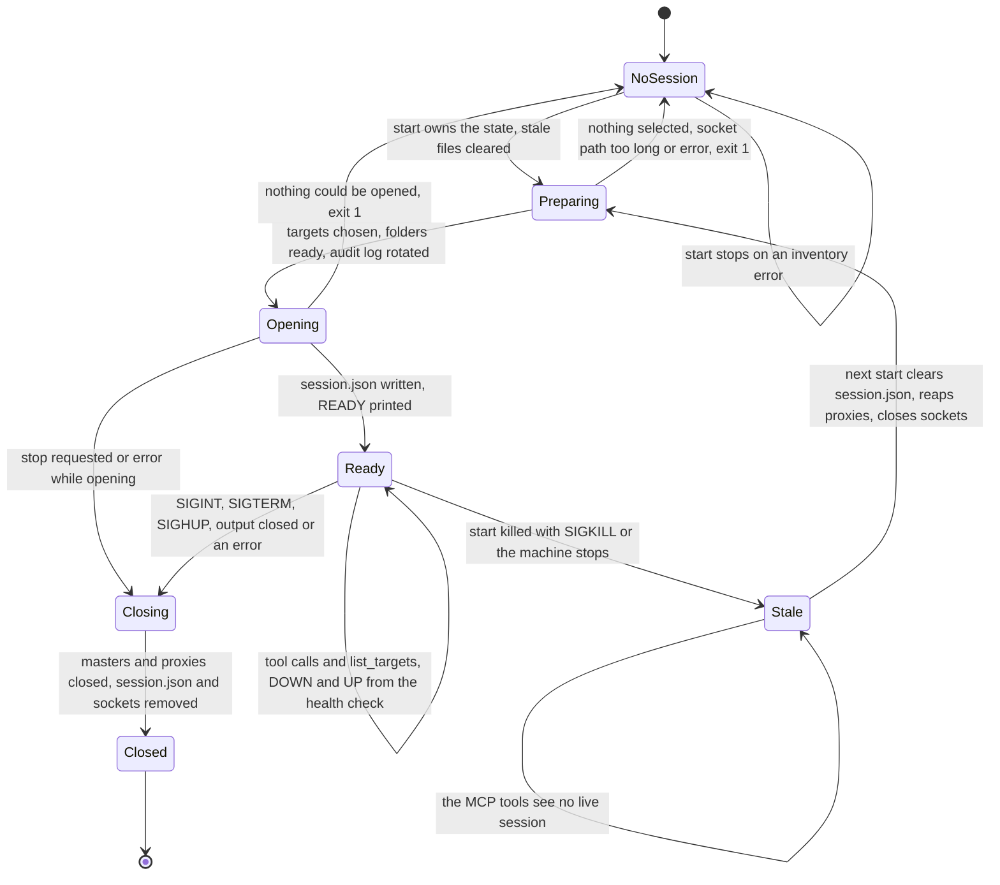
```mermaid
stateDiagram-v2
    [*] --> NoSession
    NoSession --> NoSession : start stops on an inventory error
    Ready --> Ready : a second start is refused while this one is live
    NoSession --> Preparing : start owns the state, stale files cleared
    Preparing --> NoSession : nothing selected, socket path too long or error, exit 1
    Preparing --> Opening : targets chosen, folders ready, audit log rotated
    Opening --> NoSession : nothing could be opened, exit 1
    Opening --> Closing : stop requested or error while opening
    Opening --> Ready : session.json written, READY printed
    Ready --> Ready : tool calls and list_targets, DOWN and UP from the health check
    Ready --> Closing : SIGINT, SIGTERM, SIGHUP, output closed or an error
    Closing --> Closed : masters and proxies closed, session.json and sockets removed
    Closed --> [*]
    Ready --> Stale : start killed with SIGKILL or the machine stops
    Stale --> Stale : the MCP tools see no live session
    Stale --> Preparing : next start clears session.json, reaps proxies, closes sockets
```

# PART 2: Module by module

## bin/ksproxy.js

The executable that npm puts on PATH: it hands the arguments to `runCli` and exports nothing.

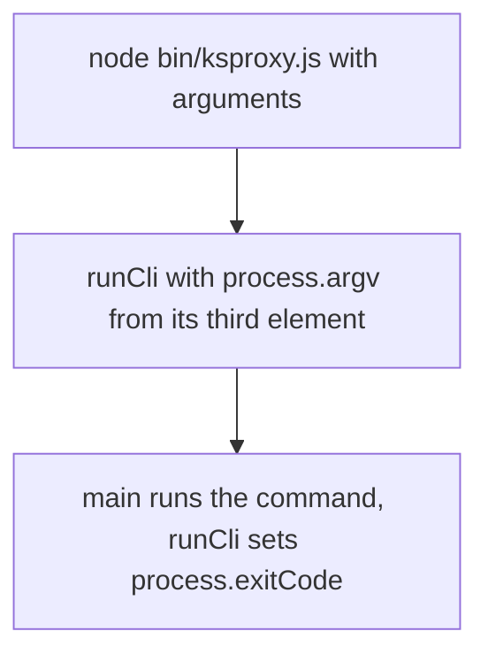
```mermaid
flowchart TD
    B1["node bin/ksproxy.js with arguments"] --> B2["runCli with process.argv from its third element"]
    B2 --> B3["main runs the command, runCli sets process.exitCode"]
```

## src/agent-md.js

Builds the text of AGENT.md (`agentMdText`) and the MCP config block (`mcpConfig`) that `start` writes into the session folder.

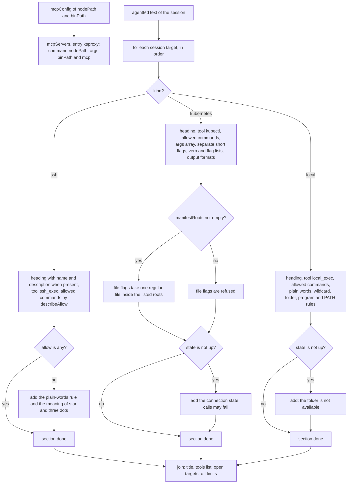
```mermaid
flowchart TD
    C1["mcpConfig of nodePath and binPath"] --> C2["mcpServers, entry ksproxy: command nodePath, args binPath and mcp"]
    A1["agentMdText of the session"] --> A2["for each session target, in order"]
    A2 --> A3{"kind?"}
    A3 -->|"ssh"| S1["heading with name and description when present,<br/>tool ssh_exec, allowed commands by describeAllow"]
    S1 --> S2{"allow is any?"}
    S2 -->|"no"| S3["add the plain-words rule and the meaning of star and three dots"]
    S2 -->|"yes"| S4["section done"]
    S3 --> S4
    A3 -->|"kubernetes"| K1["heading, tool kubectl, allowed commands,<br/>args array, separate short flags, verb and flag lists, output formats"]
    K1 --> K2{"manifestRoots not empty?"}
    K2 -->|"yes"| K3["file flags take one regular file inside the listed roots"]
    K2 -->|"no"| K4["file flags are refused"]
    K3 --> K5{"state is not up?"}
    K4 --> K5
    K5 -->|"yes"| K6["add the connection state: calls may fail"]
    K5 -->|"no"| K7["section done"]
    K6 --> K7
    A3 -->|"local"| L1["heading, tool local_exec, allowed commands,<br/>plain words, wildcard, folder, program and PATH rules"]
    L1 --> L2{"state is not up?"}
    L2 -->|"yes"| L3["add: the folder is not available"]
    L2 -->|"no"| L4["section done"]
    L3 --> L4
    S4 --> J1["join: title, tools list, open targets, off limits"]
    K7 --> J1
    L4 --> J1
```

## src/allowlist.js

Splits ssh and local commands into tokens, matches tokens against allow rules and decides; a refusal while tokenising is thrown as an `AllowError` that carries the short reason.

### tokenizeSshCommand

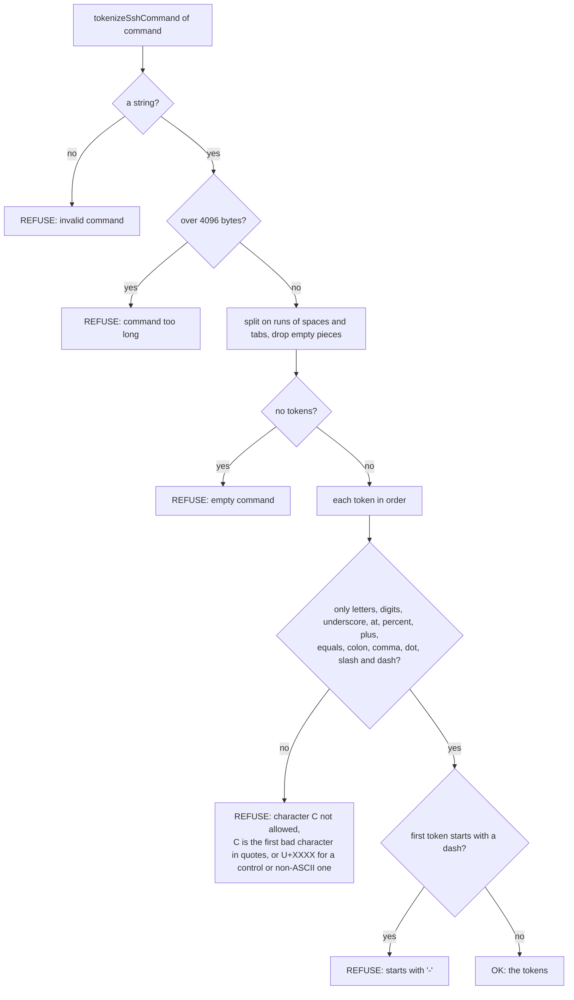
```mermaid
flowchart TD
    T1["tokenizeSshCommand of command"] --> T2{"a string?"}
    T2 -->|"no"| R1["REFUSE: invalid command"]
    T2 -->|"yes"| T3{"over 4096 bytes?"}
    T3 -->|"yes"| R2["REFUSE: command too long"]
    T3 -->|"no"| T4["split on runs of spaces and tabs, drop empty pieces"]
    T4 --> T5{"no tokens?"}
    T5 -->|"yes"| R3["REFUSE: empty command"]
    T5 -->|"no"| T6["each token in order"]
    T6 --> T7{"only letters, digits, underscore, at, percent, plus,<br/>equals, colon, comma, dot, slash and dash?"}
    T7 -->|"no"| R4["REFUSE: character C not allowed,<br/>C is the first bad character in quotes, or U+XXXX for a control or non-ASCII one"]
    T7 -->|"yes"| T8{"first token starts with a dash?"}
    T8 -->|"yes"| R5["REFUSE: starts with '-'"]
    T8 -->|"no"| T9["OK: the tokens"]
```

### checkRawSshCommand, for allow any on ssh

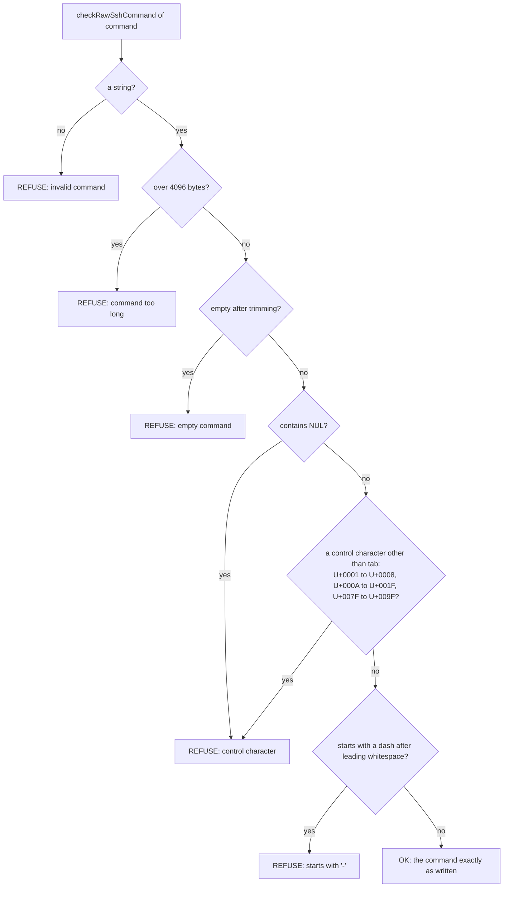
```mermaid
flowchart TD
    W1["checkRawSshCommand of command"] --> W2{"a string?"}
    W2 -->|"no"| R1["REFUSE: invalid command"]
    W2 -->|"yes"| W3{"over 4096 bytes?"}
    W3 -->|"yes"| R2["REFUSE: command too long"]
    W3 -->|"no"| W4{"empty after trimming?"}
    W4 -->|"yes"| R3["REFUSE: empty command"]
    W4 -->|"no"| W5{"contains NUL?"}
    W5 -->|"yes"| R4["REFUSE: control character"]
    W5 -->|"no"| W6{"a control character other than tab:<br/>U+0001 to U+0008, U+000A to U+001F, U+007F to U+009F?"}
    W6 -->|"yes"| R4
    W6 -->|"no"| W7{"starts with a dash after leading whitespace?"}
    W7 -->|"yes"| R5["REFUSE: starts with '-'"]
    W7 -->|"no"| W8["OK: the command exactly as written"]
```

### matchRuleDetail, matchRule and validateRule

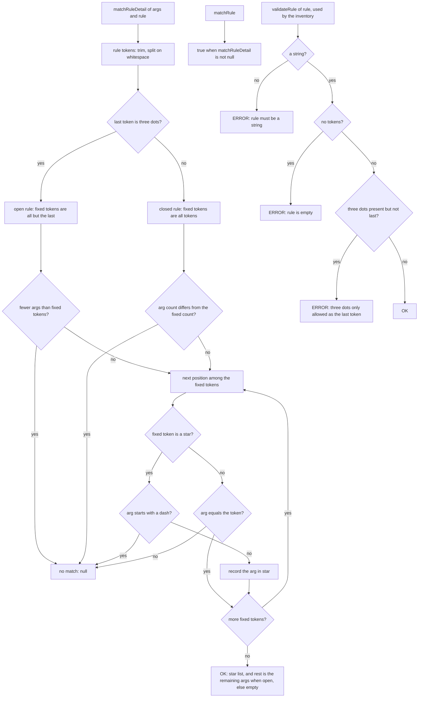
```mermaid
flowchart TD
    M1["matchRuleDetail of args and rule"] --> M2["rule tokens: trim, split on whitespace"]
    M2 --> M3{"last token is three dots?"}
    M3 -->|"yes"| M4["open rule: fixed tokens are all but the last"]
    M3 -->|"no"| M5["closed rule: fixed tokens are all tokens"]
    M4 --> M6{"fewer args than fixed tokens?"}
    M5 --> M7{"arg count differs from the fixed count?"}
    M6 -->|"yes"| N1["no match: null"]
    M7 -->|"yes"| N1
    M6 -->|"no"| M8["next position among the fixed tokens"]
    M7 -->|"no"| M8
    M8 --> M9{"fixed token is a star?"}
    M9 -->|"yes"| M10{"arg starts with a dash?"}
    M10 -->|"yes"| N1
    M10 -->|"no"| M11["record the arg in star"]
    M9 -->|"no"| M12{"arg equals the token?"}
    M12 -->|"no"| N1
    M12 -->|"yes"| M13{"more fixed tokens?"}
    M11 --> M13
    M13 -->|"yes"| M8
    M13 -->|"no"| M14["OK: star list, and rest is the remaining args when open, else empty"]
    X1["matchRule"] --> X2["true when matchRuleDetail is not null"]
    V1["validateRule of rule, used by the inventory"] --> V2{"a string?"}
    V2 -->|"no"| V3["ERROR: rule must be a string"]
    V2 -->|"yes"| V4{"no tokens?"}
    V4 -->|"yes"| V5["ERROR: rule is empty"]
    V4 -->|"no"| V6{"three dots present but not last?"}
    V6 -->|"yes"| V7["ERROR: three dots only allowed as the last token"]
    V6 -->|"no"| V8["OK"]
```

### decide and describeAllow

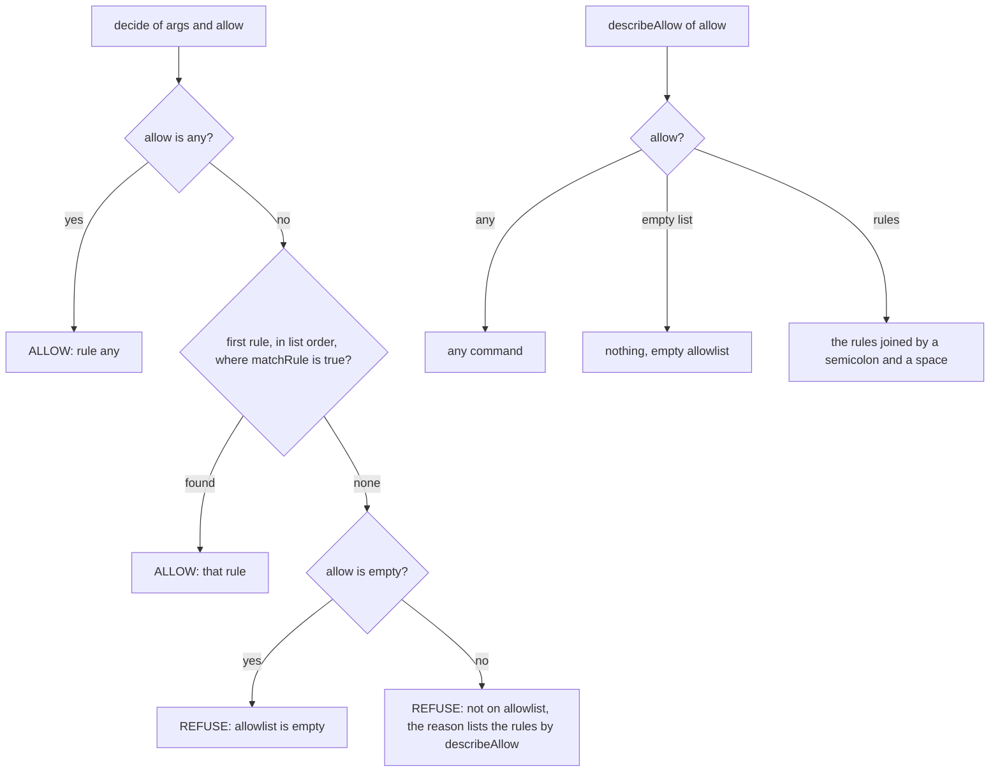
```mermaid
flowchart TD
    D1["decide of args and allow"] --> D2{"allow is any?"}
    D2 -->|"yes"| A1["ALLOW: rule any"]
    D2 -->|"no"| D3{"first rule, in list order, where matchRule is true?"}
    D3 -->|"found"| A2["ALLOW: that rule"]
    D3 -->|"none"| D4{"allow is empty?"}
    D4 -->|"yes"| R1["REFUSE: allowlist is empty"]
    D4 -->|"no"| R2["REFUSE: not on allowlist, the reason lists the rules by describeAllow"]
    E1["describeAllow of allow"] --> E2{"allow?"}
    E2 -->|"any"| E3["any command"]
    E2 -->|"empty list"| E4["nothing, empty allowlist"]
    E2 -->|"rules"| E5["the rules joined by a semicolon and a space"]
```

## src/audit.js

Appends, rotates and reads the JSON-lines audit log, and turns each entry into one log line with `formatLogLine` (also exported as `formatAuditLine`); `MAX_LOG_BYTES` is the 5 MiB rotation size.

### Writing, rotating and reading the log

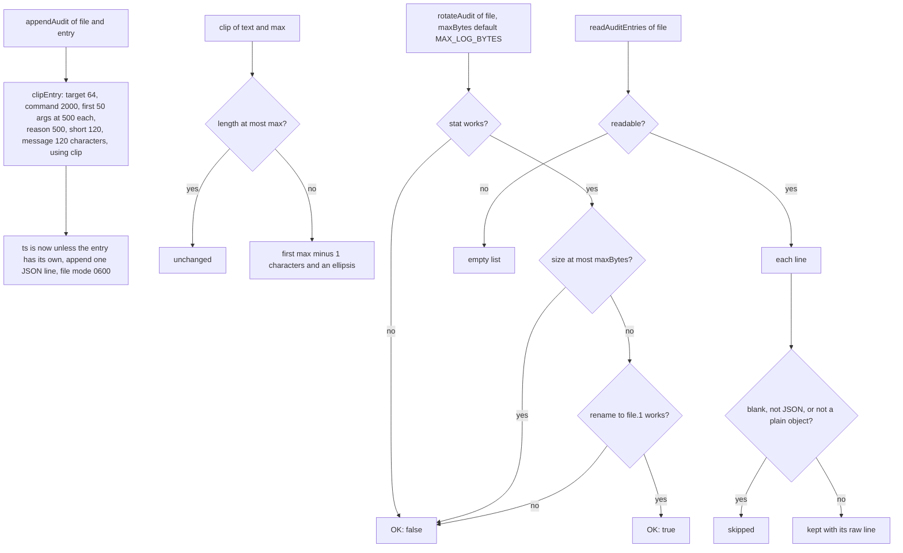
```mermaid
flowchart TD
    W1["appendAudit of file and entry"] --> W2["clipEntry: target 64, command 2000, first 50 args at 500 each,<br/>reason 500, short 120, message 120 characters, using clip"]
    W2 --> W3["ts is now unless the entry has its own, append one JSON line, file mode 0600"]
    C1["clip of text and max"] --> C2{"length at most max?"}
    C2 -->|"yes"| C3["unchanged"]
    C2 -->|"no"| C4["first max minus 1 characters and an ellipsis"]
    R1["rotateAudit of file, maxBytes default MAX_LOG_BYTES"] --> R2{"stat works?"}
    R2 -->|"no"| R3["OK: false"]
    R2 -->|"yes"| R4{"size at most maxBytes?"}
    R4 -->|"yes"| R3
    R4 -->|"no"| R5{"rename to file.1 works?"}
    R5 -->|"yes"| R6["OK: true"]
    R5 -->|"no"| R3
    E1["readAuditEntries of file"] --> E2{"readable?"}
    E2 -->|"no"| E3["empty list"]
    E2 -->|"yes"| E4["each line"]
    E4 --> E5{"blank, not JSON, or not a plain object?"}
    E5 -->|"yes"| E6["skipped"]
    E5 -->|"no"| E7["kept with its raw line"]
```

### Audit entry types and formatLogLine

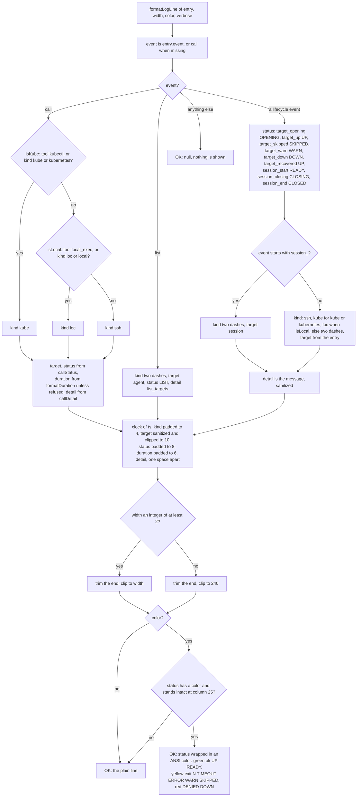
```mermaid
flowchart TD
    F1["formatLogLine of entry, width, color, verbose"] --> F2["event is entry.event, or call when missing"]
    F2 --> F3{"event?"}
    F3 -->|"call"| C1{"isKube: tool kubectl, or kind kube or kubernetes?"}
    C1 -->|"yes"| C2["kind kube"]
    C1 -->|"no"| C3{"isLocal: tool local_exec, or kind loc or local?"}
    C3 -->|"yes"| C4["kind loc"]
    C3 -->|"no"| C5["kind ssh"]
    C2 --> C6["target, status from callStatus,<br/>duration from formatDuration unless refused, detail from callDetail"]
    C4 --> C6
    C5 --> C6
    F3 -->|"list"| L1["kind two dashes, target agent, status LIST, detail list_targets"]
    F3 -->|"a lifecycle event"| Y1["status: target_opening OPENING, target_up UP, target_skipped SKIPPED,<br/>target_warn WARN, target_down DOWN, target_recovered UP,<br/>session_start READY, session_closing CLOSING, session_end CLOSED"]
    Y1 --> Y2{"event starts with session_?"}
    Y2 -->|"yes"| Y3["kind two dashes, target session"]
    Y2 -->|"no"| Y4["kind: ssh, kube for kube or kubernetes, loc when isLocal, else two dashes,<br/>target from the entry"]
    Y3 --> Y5["detail is the message, sanitized"]
    Y4 --> Y5
    F3 -->|"anything else"| N1["OK: null, nothing is shown"]
    C6 --> J1["clock of ts, kind padded to 4, target sanitized and clipped to 10,<br/>status padded to 8, duration padded to 6, detail, one space apart"]
    L1 --> J1
    Y5 --> J1
    J1 --> J2{"width an integer of at least 2?"}
    J2 -->|"yes"| J3["trim the end, clip to width"]
    J2 -->|"no"| J4["trim the end, clip to 240"]
    J3 --> J5{"color?"}
    J4 --> J5
    J5 -->|"no"| O1["OK: the plain line"]
    J5 -->|"yes"| J6{"status has a color and stands intact at column 25?"}
    J6 -->|"no"| O1
    J6 -->|"yes"| O2["OK: status wrapped in an ANSI color: green ok UP READY,<br/>yellow exit N TIMEOUT ERROR WARN SKIPPED, red DENIED DOWN"]
```

### callStatus and callDetail

```mermaid
flowchart TD
    S1["callStatus"] --> S2{"decision refused?"}
    S2 -->|"yes"| S3["DENIED"]
    S2 -->|"no"| S4{"spawnError set and not null?"}
    S4 -->|"yes"| S5["ERROR"]
    S4 -->|"no"| S6{"timedOut?"}
    S6 -->|"yes"| S7["TIMEOUT"]
    S6 -->|"no"| S8{"exitCode is 0?"}
    S8 -->|"yes"| S9["ok"]
    S8 -->|"no"| S10["exit and the code sanitized, a question mark when missing, clipped to 12"]
    D1["callDetail"] --> D2["raw is args for a kube entry, else command"]
    D2 --> D3{"raw?"}
    D3 -->|"array"| D4["joined with spaces"]
    D3 -->|"string"| D5["as is"]
    D3 -->|"missing"| D6["empty"]
    D3 -->|"anything else"| D7["(invalid)"]
    D4 --> D8["sanitizeForTerminal"]
    D5 --> D8
    D6 --> D8
    D7 --> D8
    D8 --> D9{"refused?"}
    D9 -->|"yes"| D10{"short, else reason clipped to 60, present?"}
    D10 -->|"no"| D11["the text"]
    D10 -->|"yes"| D12["reason sanitized, clipped to 120, in square brackets,<br/>after the text and two spaces, or alone when the text is empty"]
    D9 -->|"no"| D13{"verbose?"}
    D13 -->|"no"| D11
    D13 -->|"yes"| D14{"rule, finite stdoutBytes or finite stderrBytes present?"}
    D14 -->|"no"| D11
    D14 -->|"yes"| D15["text, two spaces, then rule, out NB and err NB in parentheses"]
```

### Small helpers

```mermaid
flowchart TD
    K1["clock of ts"] --> K2{"a valid date?"}
    K2 -->|"no"| K3["--:--:--"]
    K2 -->|"yes"| K4["local HH:MM:SS"]
    T1["sanitizeForTerminal of text"] --> T2["control, bidirectional, zero-width, line and paragraph separator characters<br/>and the byte order mark become a backslash, u and four hex digits"]
    U1["formatDuration of ms"] --> U2{"a finite number of at least 0?"}
    U2 -->|"no"| U3["empty"]
    U2 -->|"yes"| U4{"under 60000?"}
    U4 -->|"yes"| U5["seconds with one decimal and s, like 0.4s"]
    U4 -->|"no"| U6["minutes, m, two-digit seconds, s, like 1m05s"]
    G1["logOptionsFor of stream and env"] --> G2{"stream is a TTY?"}
    G2 -->|"no"| G3["width 240, no color"]
    G2 -->|"yes"| G4["width: columns when a positive integer, else 120.<br/>color: NO_COLOR unset and TERM not dumb"]
```

## src/cli.js

Parses the command line and runs one command (`main`), and turns its result into the process exit code (`runCli`).

### main and runCli

```mermaid
flowchart TD
    M1["main of argv, env, host"] --> M2{"no command, --help or -h?"}
    M2 -->|"yes"| M3["OK: print usage, 0"]
    M2 -->|"no"| M4{"--version?"}
    M4 -->|"yes"| M5["OK: print the package version, 0"]
    M4 -->|"no"| M6{"command?"}
    M6 -->|"init"| M7["init"]
    M6 -->|"start"| M8["parseStartArgs"]
    M8 --> M9{"error?"}
    M9 -->|"yes"| U1["usage error: message and usage on stderr, 2"]
    M9 -->|"no"| M10["start with the options, its result is the exit code"]
    M6 -->|"status"| M11["status"]
    M6 -->|"log"| M12["parseLogArgs"]
    M12 --> M13{"error?"}
    M13 -->|"yes"| U1
    M13 -->|"no"| M14["showLog"]
    M6 -->|"check"| M15["check"]
    M6 -->|"mcp"| M16["serve on stdin and stdout until the input ends, then 0"]
    M6 -->|"anything else"| U2["usage error: unknown command: NAME, 2"]
    R1["runCli of argv, proc"] --> R2["main with proc.env and the process"]
    R2 --> R3{"settled how?"}
    R3 -->|"resolved"| R4["process.exitCode is the result"]
    R3 -->|"rejected"| R5["print ksproxy: MESSAGE on stderr, exitCode 1"]
```

### parseStartArgs

```mermaid
flowchart TD
    P1["next argument"] --> P2{"--all?"}
    P2 -->|"yes"| P3["all"]
    P2 -->|"no"| P4{"-v or --verbose?"}
    P4 -->|"yes"| P5["verbose"]
    P4 -->|"no"| P6{"--ssh, --kube or --local, alone or with an equals sign and value?"}
    P6 -->|"no"| E1["ERROR: unknown option for start: ARG"]
    P6 -->|"yes"| P7{"value after an equals sign?"}
    P7 -->|"yes"| P9["split the value on commas, trim, drop empty names"]
    P7 -->|"no"| P8{"a next argument?"}
    P8 -->|"no"| E2["ERROR: FLAG needs a comma-separated list of names"]
    P8 -->|"yes, consumed"| P9
    P9 --> P10["append to that kind's list, which now counts as given even when empty"]
    P3 --> P11{"more arguments?"}
    P5 --> P11
    P10 --> P11
    P11 -->|"yes"| P1
    P11 -->|"no"| P12["OK: options ssh, kube, local, all, verbose"]
```

### parseLogArgs and showLog

```mermaid
flowchart TD
    A1["parseLogArgs: next argument"] --> A2{"which?"}
    A2 -->|"--denied"| A3["denied"]
    A2 -->|"--json"| A4["json"]
    A2 -->|"-n"| A5{"next argument is digits only, from 1 to 5000?"}
    A5 -->|"no"| E1["ERROR: -n needs a number from 1 to 5000"]
    A5 -->|"yes"| A6["count"]
    A2 -->|"anything else"| E2["ERROR: unknown option for log: ARG"]
    A3 --> A7["defaults: count 50, not denied, not json"]
    A4 --> A7
    A6 --> A7
    L1["showLog"] --> L2{"audit.log exists?"}
    L2 -->|"no"| L3["OK: print no log yet, 0"]
    L2 -->|"yes"| L4["readAuditEntries"]
    L4 --> L5{"--denied?"}
    L5 -->|"yes"| L6["keep only calls, event missing or call, that were refused"]
    L5 -->|"no"| L7["each row"]
    L6 --> L7
    L7 --> L8{"--json?"}
    L8 -->|"yes"| L9["the raw line, sanitized"]
    L8 -->|"no"| L10["formatLogLine, always verbose"]
    L9 --> L11{"null, or it threw?"}
    L10 --> L11
    L11 -->|"yes"| L12["row skipped"]
    L11 -->|"no"| L13["kept"]
    L13 --> L14["OK: print the last count lines, 0"]
    L12 --> L14
```

### status and init

```mermaid
flowchart TD
    S1["status"] --> S2["liveSession of the session folder"]
    S2 --> S3{"none, or targets not a list?"}
    S3 -->|"yes"| S4["print the no-session hint to run ksproxy start, 1"]
    S3 -->|"no"| S5["print session pid and start time"]
    S5 --> S6["next target: targetState, print state, kind and name"]
    S6 --> S7{"state is not up?"}
    S7 -->|"yes"| S8["not all up"]
    S7 -->|"no"| S15{"more targets?"}
    S8 --> S15
    S15 -->|"yes"| S6
    S15 -->|"no"| S9["lastCallSummary: calls after the last session_start"]
    S9 --> S10{"any calls?"}
    S10 -->|"yes"| S11["print the time of the last call and the number of calls this session"]
    S10 -->|"no"| S12{"all up?"}
    S11 --> S12
    S12 -->|"yes"| S13["OK: 0"]
    S12 -->|"no"| S14["1"]
    I1["init"] --> I2{"inventory.json exists?"}
    I2 -->|"yes"| I3["OK: print already exists, 0, never overwritten"]
    I2 -->|"no"| I4["ensureDir of the config folder"]
    I4 --> I5["writeFileAtomic of SAMPLE_INVENTORY as JSON"]
    I5 --> I6["OK: print wrote FILE, 0"]
```

### check

```mermaid
flowchart TD
    C1["check KIND NAME WORDS"] --> C2{"KIND is ssh, kube or local, NAME given and at least one word?"}
    C2 -->|"no"| C3["usage error, 2"]
    C2 -->|"yes"| C4["loadInventory"]
    C4 --> C5{"thrown?"}
    C5 -->|"InventoryError"| C6["print it, 2"]
    C5 -->|"any other error"| C7["rethrown"]
    C5 -->|"no"| C8{"a target of that kind with that name?"}
    C8 -->|"no"| C9["print unknown KIND target NAME and the known names, 2"]
    C8 -->|"yes"| C10{"KIND?"}
    C10 -->|"ssh"| C11["decideSsh with the words joined by spaces"]
    C10 -->|"kube"| C12["decideKube with the words as args"]
    C10 -->|"local"| C13["localFolderProblem with the inventory kubeconfigs"]
    C13 --> C14{"a problem?"}
    C14 -->|"yes"| R1["REFUSE: print REFUSED and the folder problem, 1"]
    C14 -->|"no"| C15["decideLocal, protected is the inventory kubeconfigs,<br/>words joined by spaces"]
    C11 --> C16{"allowed?"}
    C12 --> C16
    C15 --> C16
    C16 -->|"yes"| A1["ALLOW: print ALLOWED by rule: RULE, 0"]
    C16 -->|"no"| R2["REFUSE: print REFUSED and the reason, 1"]
```

## src/exec.js

Runs one program without a shell, with a timeout, a process-group kill, a grace period and output caps (`run`), and builds the small environment it gets (`minimalEnv`).

### run

```mermaid
flowchart TD
    X1["run of file, args, timeoutMs, maxBytes, env, inherit, cwd, graceMs 500"] --> X2["spawn: its own process group and piped output,<br/>or the terminal when inherit"]
    X2 --> X3{"spawn threw?"}
    X3 -->|"yes"| X4["spawnError is the message"]
    X4 --> F1["finish"]
    X3 -->|"no"| X5{"inherit?"}
    X5 -->|"no"| X6["collect stdout and stderr with caps, count open streams"]
    X5 -->|"yes"| X7["start the timeout timer"]
    X6 --> X7
    X7 --> X8{"what happens first?"}
    X8 -->|"timeout"| X9["timedOut, SIGTERM to the group, or to the child if that fails or when inherit"]
    X9 --> X10["after 2 s, SIGKILL the same way"]
    X10 --> X8
    X8 -->|"error event"| X11["spawnError is the message"]
    X11 --> F1
    X8 -->|"exit event"| X12["record exit code and signal"]
    X12 --> X13{"inherit?"}
    X13 -->|"yes"| X14["wait for the close event, then finish"]
    X13 -->|"no"| X15["start the grace timer"]
    X15 --> X16{"both streams closed before the grace period ends?"}
    X16 -->|"yes"| X17["take the collected output"]
    X16 -->|"no"| X18["destroy both streams, take the collected output"]
    X17 --> F1
    X18 --> F1
    X14 --> F1
    F1 --> F2{"already finished?"}
    F2 -->|"yes"| F3["nothing more"]
    F2 -->|"no"| F4{"not inherit and the child has a pid?"}
    F4 -->|"yes"| F5["SIGKILL the whole process group, errors ignored"]
    F4 -->|"no"| F6["clear the timers, set durationMs"]
    F5 --> F6
    F6 --> F7["OK: resolve the result, run never rejects"]
```

### Output caps and minimalEnv

```mermaid
flowchart TD
    C1["a chunk arrives on stdout or stderr"] --> C2["add its length to the stream's byte count"]
    C2 --> C3{"room left under maxBytes for this stream?"}
    C3 -->|"yes"| C4["keep the part that fits"]
    C3 -->|"no"| C5{"chunk longer than the room?"}
    C4 --> C5
    C5 -->|"yes"| C6["truncated"]
    C5 -->|"no"| C7["done"]
    E1["minimalEnv of env, extra, own"] --> E2["copy PATH, HOME, LANG, LC_ALL and TMPDIR when set"]
    E2 --> E3{"own?"}
    E3 -->|"yes"| E4["also copy every KSPROXY_ variable"]
    E3 -->|"no"| E5["extra values override"]
    E4 --> E5
```

## src/inventory.js

Reads and validates inventory.json (`loadInventory`, `validateInventory`) and throws an `InventoryError` that names the entry and field; `SAMPLE_INVENTORY` is what `ksproxy init` writes.

### loadInventory and the top level

```mermaid
flowchart TD
    L1["loadInventory of file"] --> L2{"read works?"}
    L2 -->|"ENOENT"| E1["ERROR: inventory not found, run ksproxy init"]
    L2 -->|"another error"| E2["ERROR: cannot read inventory"]
    L2 -->|"yes"| L3{"valid JSON?"}
    L3 -->|"no"| E3["ERROR: inventory is not valid JSON"]
    L3 -->|"yes"| V1["validateInventory"]
    V1 --> V2{"an object?"}
    V2 -->|"no"| E4["ERROR: top level must be an object"]
    V2 -->|"yes"| V3{"only the keys ssh, kubernetes and local?"}
    V3 -->|"no"| E5["ERROR: unknown key"]
    V3 -->|"yes"| V4{"each of them absent or an array?"}
    V4 -->|"no"| E6["ERROR: KIND must be an array"]
    V4 -->|"yes"| V5["ssh entries, then kubernetes entries, then local entries,<br/>ports checked across the whole file"]
    V5 --> V6["OK: ssh, kubernetes and local lists"]
```

### Common checks, ssh entries and checkAllow

```mermaid
flowchart TD
    C1["checkCommon of an entry"] --> C2["where: KIND and the name when valid, else KIND and the index"]
    C2 --> C3{"an object?"}
    C3 -->|"no"| E1["ERROR: must be an object"]
    C3 -->|"yes"| C4{"name matches lowercase letters, digits and dashes,<br/>starting with a letter or digit, at most 31 long?"}
    C4 -->|"no"| E2["ERROR: name must match"]
    C4 -->|"yes"| C5{"name already used in this kind?"}
    C5 -->|"yes"| E3["ERROR: duplicate name"]
    C5 -->|"no"| C6{"description present and not a string?"}
    C6 -->|"yes"| E4["ERROR: description must be a string"]
    C6 -->|"no"| S1{"ssh: only the keys name, host, description, allow?"}
    S1 -->|"no"| E5["ERROR: unknown key"]
    S1 -->|"yes"| S2{"host a string of letters, digits, dot, underscore, at and dash,<br/>starting with a letter or digit?"}
    S2 -->|"no"| E6["ERROR: host must match, no leading dash"]
    S2 -->|"yes"| A1["checkAllow, any allowed"]
    A1 --> A2{"allow?"}
    A2 -->|"missing"| A3["OK: empty list"]
    A2 -->|"any"| A4{"any allowed for this kind?"}
    A4 -->|"yes"| A5["OK: any"]
    A4 -->|"no, local"| E7["ERROR: any is not supported for local targets"]
    A2 -->|"not an array"| E8["ERROR: allow must be any or an array of rule strings"]
    A2 -->|"array"| A6{"each rule passes validateRule?"}
    A6 -->|"no"| E9["ERROR: allow index and the rule error"]
    A6 -->|"yes"| A7{"local, and a rule starts with a star or three dots?"}
    A7 -->|"yes"| E10["ERROR: a local rule must start with the program name"]
    A7 -->|"no"| A8["OK: a copy of the rules"]
```

### Kubernetes entries

```mermaid
flowchart TD
    K0["checkCommon"] --> K1{"only the keys name, kubeconfig, proxyPort,<br/>tunnel, manifestRoots, description, allow?"}
    K1 -->|"no"| E0["ERROR: unknown key"]
    K1 -->|"yes"| K2{"kubeconfig a non-empty string, absolute after expanding a leading tilde?"}
    K2 -->|"no"| E1["ERROR: kubeconfig must be a non-empty path, or absolute or start with tilde slash"]
    K2 -->|"yes"| K3{"proxyPort an integer from 1024 to 65535?"}
    K3 -->|"no"| E2["ERROR: proxyPort must be an integer between 1024 and 65535"]
    K3 -->|"yes"| K4{"port already used in the file?"}
    K4 -->|"yes"| E3["ERROR: port is already used elsewhere in the inventory"]
    K4 -->|"no"| K5{"tunnel present?"}
    K5 -->|"yes"| T1{"an object with only host, localPort and remote?"}
    T1 -->|"no"| E4["ERROR: tunnel must be an object, or unknown key"]
    T1 -->|"yes"| T2{"host valid as for ssh?"}
    T2 -->|"no"| E5["ERROR: tunnel.host must match"]
    T2 -->|"yes"| T3{"localPort valid and unused, as for proxyPort?"}
    T3 -->|"no"| E6["ERROR: tunnel.localPort, as for proxyPort"]
    T3 -->|"yes"| T4{"remote is host colon port, port from 1 to 65535?"}
    T4 -->|"no"| E7["ERROR: tunnel.remote must be host:port"]
    T4 -->|"yes"| K6{"manifestRoots present?"}
    K5 -->|"no"| K6
    K6 -->|"yes"| M1{"an array of paths, each absolute after expanding a leading tilde?"}
    M1 -->|"no"| E8["ERROR: manifestRoots must be an array, or a path error"]
    M1 -->|"yes"| K7["checkAllow, any allowed"]
    K6 -->|"no"| K7
    K7 --> K8["OK: kubernetes target with tunnel or null and manifestRoots or empty"]
```

### Local entries

```mermaid
flowchart TD
    L0["checkCommon"] --> L1{"only the keys name, cwd, description, allow?"}
    L1 -->|"no"| E0["ERROR: unknown key"]
    L1 -->|"yes"| L2{"cwd a non-empty string, absolute after expanding a leading tilde?"}
    L2 -->|"no"| E1["ERROR: cwd must be a non-empty path, or absolute or start with tilde slash"]
    L2 -->|"yes"| L3["cwd normalised with path.resolve"]
    L3 --> L4["checkAllow, any not allowed, every rule must start with the program"]
    L4 --> L5["OK: local target"]
```

## src/kube.js

The Kubernetes side: the gate (`hardRefusalDetail`, `hardRefusal`), the proxy process (`openCluster`, `closeCluster`, `probeVersion`, `portListening`, `reapStaleProxies`, `commandLine`) and the builders (`kubeconfigText`, `proxyArgs` with `REJECT_PATHS`, `kubectlArgs`).

### hardRefusalDetail, in order

```mermaid
flowchart TD
    H1["hardRefusalDetail of args and manifestRoots"] --> H2{"args a non-empty list of non-empty strings,<br/>each at most 4096 bytes, no control characters?"}
    H2 -->|"no"| R1["REFUSE: invalid arguments"]
    H2 -->|"yes"| H3{"first arg starts with a dash?"}
    H3 -->|"yes"| R2["REFUSE: verb must come first"]
    H3 -->|"no"| H4{"verb on the list: get, describe, logs, top, explain, api-resources,<br/>api-versions, version, events, auth, cluster-info, apply, create, delete,<br/>patch, replace, rollout, scale, autoscale, label, annotate, set, expose,<br/>wait, diff, cordon, uncordon, drain, taint?"}
    H4 -->|"no"| R3["REFUSE: verb 'VERB' unavailable, VERB clipped to 20"]
    H4 -->|"yes"| H5{"verb create and some arg is token?"}
    H5 -->|"yes"| R4["REFUSE: create token"]
    H5 -->|"no"| H6{"verb cluster-info and some arg is dump?"}
    H6 -->|"yes"| R5["REFUSE: cluster-info dump"]
    H6 -->|"no"| H7{"verb auth and the second arg is neither can-i nor whoami?"}
    H7 -->|"yes"| R6["REFUSE: auth: only can-i, whoami"]
    H7 -->|"no"| H8{"verb apply and some arg is edit-last-applied?"}
    H8 -->|"yes"| R7["REFUSE: opens an editor"]
    H8 -->|"no"| H9["secret scan: every arg, and for an arg with an equals sign also the part after the first one,<br/>split on commas, each part trimmed"]
    H9 --> H10{"a part is secret or secrets, alone or followed by a dot or slash, any letter case?"}
    H10 -->|"yes"| R8["REFUSE: secret resource"]
    H10 -->|"no"| H11["flag loop, next diagram"]
    H11 --> H12{"a flag refused?"}
    H12 -->|"yes"| R9["REFUSE: the flag loop's short reason"]
    H12 -->|"no"| A1["ALLOW: null, no hard refusal"]
```

### The flag loop

```mermaid
flowchart TD
    F1["next arg after the verb"] --> F2{"starts with a dash?"}
    F2 -->|"no"| F20{"more args?"}
    F2 -->|"yes"| F3{"exactly two dashes?"}
    F3 -->|"yes"| R1["REFUSE: bare '--'"]
    F3 -->|"no"| F4{"one dash, longer than 2, third character not an equals sign?"}
    F4 -->|"yes"| R2["REFUSE: combined short flags"]
    F4 -->|"no"| F5["name: the part before the first equals sign,<br/>underscores become dashes in a long flag"]
    F5 --> F6{"name on the flag list: scope and selection, output, manifests, logs,<br/>writes, node maintenance, explain, api-resources, auth, version, top?"}
    F6 -->|"no"| R3["REFUSE: flag NAME unavailable, NAME clipped to 30"]
    F6 -->|"yes"| F7{"name is -o or --output?"}
    F7 -->|"yes"| F8["value: after the equals sign, else the next arg, which is then skipped"]
    F8 --> F9{"value is json, yaml, wide or name, or jsonpath=, jsonpath-as-json=<br/>or custom-columns= followed by at least one character?"}
    F9 -->|"no"| R4["REFUSE: output format"]
    F9 -->|"yes"| F20
    F7 -->|"no"| F10{"name is -f, --filename or --patch-file,<br/>and not -f with the verb logs?"}
    F10 -->|"no"| F20
    F10 -->|"yes"| F11["value as for -o"]
    F11 --> F12["manifestRefusal, next diagram"]
    F12 --> F13{"refused?"}
    F13 -->|"yes"| R5["REFUSE: the manifest short reason"]
    F13 -->|"no"| F20
    F20 -->|"yes"| F1
    F20 -->|"no"| A1["ALLOW: no flag refused"]
```

### The manifest-file rule

```mermaid
flowchart TD
    G1["manifestRefusal of FLAG, value, manifestRoots"] --> G2{"a value?"}
    G2 -->|"no"| R1["REFUSE: FLAG needs a path"]
    G2 -->|"yes"| G3{"starts with http:// or https://, any case, or is a single dash?"}
    G3 -->|"yes"| R2["REFUSE: FLAG: not a local file"]
    G3 -->|"no"| G4{"manifestRoots a non-empty list?"}
    G4 -->|"no"| R3["REFUSE: no manifestRoots"]
    G4 -->|"yes"| G5["real path of the value, resolved against the working folder"]
    G5 --> G6{"resolves?"}
    G6 -->|"no"| R4["REFUSE: FLAG: file not found"]
    G6 -->|"yes"| G7["real paths of the roots that resolve"]
    G7 --> G8{"the real path equals a root or lies inside one,<br/>or a root is the filesystem root?"}
    G8 -->|"no"| R5["REFUSE: FLAG: outside manifestRoots"]
    G8 -->|"yes"| G9{"a regular file?"}
    G9 -->|"no, or stat fails"| R6["REFUSE: FLAG: not a single file"]
    G9 -->|"yes"| A1["ALLOW: null"]
```

### openCluster

```mermaid
flowchart TD
    O1["openCluster of target, sessionDir"] --> O2{"kubeconfig file exists?"}
    O2 -->|"no"| X1["FAIL: kubeconfig not found: PATH"]
    O2 -->|"yes"| O3{"portListening on the proxy port already?"}
    O3 -->|"yes"| X2["FAIL: port PORT is already in use"]
    O3 -->|"no"| O4{"tunnel configured?"}
    O4 -->|"yes"| O5["openMaster on socket tun-NAME with a local forward<br/>127.0.0.1 LOCALPORT to REMOTE"]
    O5 --> O6{"ok?"}
    O6 -->|"no"| X3["FAIL: ssh tunnel: the ssh error"]
    O6 -->|"yes"| O7["spawn kubectl proxy with proxyArgs,<br/>output appended to kube-NAME.log in the session folder"]
    O4 -->|"no"| O7
    O7 --> O8{"the child has a pid?"}
    O8 -->|"yes"| O9["write kube-NAME.pid in the socket folder: pid and processStartTime"]
    O8 -->|"no"| O10["poll portListening every 250 ms for up to 10 s,<br/>stop early when the child exits or errors"]
    O9 --> O10
    O10 --> O11{"listening?"}
    O11 -->|"no"| O12["closeCluster"]
    O12 --> X4["FAIL: kubectl proxy did not start, see kube-NAME.log"]
    O11 -->|"yes"| O13["probeVersion"]
    O13 --> OK1["OK: ok, state up, auth or fail, child, tunnel, pid file"]
    O7 -->|"an error thrown from here on"| O14["closeCluster"]
    O14 --> X5["FAIL: the error message"]
```

### closeCluster, probeVersion, portListening

```mermaid
flowchart TD
    C1["closeCluster of handle, graceMs 2000"] --> C2{"child still running?"}
    C2 -->|"yes"| C3["SIGTERM, wait for exit at most graceMs"]
    C3 --> C4{"still running?"}
    C4 -->|"yes"| C5["SIGKILL"]
    C4 -->|"no"| C6{"tunnel?"}
    C5 --> C6
    C2 -->|"no"| C6
    C6 -->|"yes"| C7["closeMaster of the tunnel"]
    C6 -->|"no"| C8{"pid file?"}
    C7 --> C8
    C8 -->|"yes"| C9["remove it"]
    C8 -->|"no"| C10["OK: done, each step guarded, never throws"]
    C9 --> C10
    P1["probeVersion of port, timeout 4 s"] --> P2["GET /version on 127.0.0.1 and the port"]
    P2 --> P3{"answer?"}
    P3 -->|"status 200"| P4["up"]
    P3 -->|"status 401 or 403"| P5["auth"]
    P3 -->|"other status, timeout or error"| P6["fail"]
    Q1["portListening of port, timeout 500 ms"] --> Q2{"TCP connect to 127.0.0.1 works in time?"}
    Q2 -->|"yes"| Q3["true"]
    Q2 -->|"no, error or timeout"| Q4["false"]
```

### reapStaleProxies and commandLine

```mermaid
flowchart TD
    R1["reapStaleProxies of socketDir"] --> R2{"folder readable?"}
    R2 -->|"no"| R3["OK: 0"]
    R2 -->|"yes"| R4["next file ending in .pid"]
    R4 --> R5{"JSON with a positive integer pid and a finite startedAt?"}
    R5 -->|"no"| R14["remove the pid file"]
    R5 -->|"yes"| R6{"signal 0 to the pid works?"}
    R6 -->|"no"| R14
    R6 -->|"yes"| R7{"processStartTime known and within 5 s of startedAt?"}
    R7 -->|"no"| R14
    R7 -->|"yes"| R8["commandLine: ps -o command= -p PID, 2 s timeout,<br/>trimmed output when ps exits 0, else null"]
    R8 --> R9{"known and contains the word proxy with a space on each side?"}
    R9 -->|"no"| R14
    R9 -->|"yes"| R10{"SIGTERM works?"}
    R10 -->|"no"| R14
    R10 -->|"yes"| R11["count it, then every 50 ms for up to 2 s check whether the pid is gone"]
    R11 --> R12{"gone: signal 0 fails with ESRCH?"}
    R12 -->|"no"| R13["SIGKILL, errors ignored"]
    R12 -->|"yes"| R14
    R13 --> R14
    R14 --> R15{"more pid files?"}
    R15 -->|"yes"| R4
    R15 -->|"no"| R16["OK: the number signalled"]
```

### Builders and hardRefusal

```mermaid
flowchart TD
    B1["kubeconfigText of targets"] --> B2["one cluster per target with server http://127.0.0.1:PORT,<br/>one user none without credentials, one context per target"]
    B3["proxyArgs of kubeconfig and port"] --> B4["--kubeconfig FILE proxy --address=127.0.0.1 --port=PORT<br/>--reject-paths=REJECT_PATHS"]
    B5["REJECT_PATHS"] --> B6["API paths for pod exec, attach and portforward,<br/>secrets and service account tokens"]
    B7["kubectlArgs of file, name, args"] --> B8["--kubeconfig FILE --context NAME, then the args"]
    B9["hardRefusal of args and manifestRoots"] --> B10["the reason of hardRefusalDetail, or null"]
```

## src/local.js

Path checks for local targets: the wildcard and value checks (`wildcardProblem`, `plainValues`, `valueProblem`), path resolution (`realish`, `dropDataVolume`, `isInside`, `isCaseInsensitive`), the link check (`crossesPseudoFs`), the folder check (`localFolderProblem`) and what a session records and uses (`sessionProtected`, `protectedPaths`, `localScope`, `cleanPath`).

### wildcardProblem and plainValues

```mermaid
flowchart TD
    W1["wildcardProblem of detail, target, env, scope"] --> W2["next arg matched by a star, then each arg matched by three dots"]
    W2 --> W3["plainValues: the arg as a one-element list when plain, else null"]
    W3 --> W4{"plain: first a letter, digit, underscore or dot,<br/>then only letters, digits, underscore, dot, slash or dash?"}
    W4 -->|"no"| R1["REFUSE: not a plain argument"]
    W4 -->|"yes"| W5{"value already checked in this decision?"}
    W5 -->|"no"| W6["valueProblem, remembered in scope.checked"]
    W5 -->|"yes"| W7{"a problem?"}
    W6 --> W7
    W7 -->|"yes"| R2["REFUSE: that problem"]
    W7 -->|"no"| W8{"more args?"}
    W8 -->|"yes"| W2
    W8 -->|"no"| A1["ALLOW: null"]
```

### valueProblem

```mermaid
flowchart TD
    V1["valueProblem of value, target, env, scope"] --> V2{"over 512 bytes?"}
    V2 -->|"yes"| R1["REFUSE: argument too long"]
    V2 -->|"no"| V3{"a slash-separated segment is two dots?"}
    V3 -->|"yes"| R2["REFUSE: contains '..'"]
    V3 -->|"no"| V4["simplify: drop empty and single-dot segments, keep a leading slash"]
    V4 --> V5{"absolute?"}
    V5 -->|"yes"| V6["joined is the simplified value"]
    V5 -->|"no"| V7{"empty?"}
    V7 -->|"yes"| V8["joined is the real folder of the target, from scope.cwdReal"]
    V7 -->|"no"| V9["joined is the real folder, a separator and the simplified value"]
    V6 --> V10{"joined over 1000 bytes?"}
    V8 --> V10
    V9 --> V10
    V10 -->|"yes"| R1
    V10 -->|"no"| V11["examine joined, as realish does"]
    V11 --> V11a{"examine failed with ELOOP?"}
    V11a -->|"yes"| R3["REFUSE: unresolvable link"]
    V11a -->|"no"| V11b{"crossesPseudoFs of joined?"}
    V11b -->|"yes"| R7["REFUSE: system link"]
    V11b -->|"no"| V12{"examined?"}
    V12 -->|"no, ENOENT"| R3
    V12 -->|"no, any other code"| R4["REFUSE: cannot be examined"]
    V12 -->|"yes"| V13["resolved is path.resolve of joined, real is the examined path"]
    V13 --> V14{"for a protected location in scope.protectedList:<br/>resolved inside it, real inside it, or it inside real?"}
    V14 -->|"yes"| R5["REFUSE: ksproxy files"]
    V14 -->|"no"| V15{"cwdReal unknown, or real not inside cwdReal?"}
    V15 -->|"yes"| R6["REFUSE: outside the folder"]
    V15 -->|"no"| A1["ALLOW: null"]
```

### realish and dropDataVolume

```mermaid
flowchart TD
    E1["realish of p: examine p"] --> E2["current is p, rest is empty"]
    E2 --> E3{"lstat of current"}
    E3 -->|"fails with a code other than ENOENT or ENOTDIR"| N1["null: cannot be examined"]
    E3 -->|"exists"| E4{"realpath of current works?"}
    E4 -->|"no"| N1
    E4 -->|"yes"| E5["OK: real path of current with rest appended, then dropDataVolume"]
    E3 -->|"ENOENT or ENOTDIR"| E6{"current is the filesystem root?"}
    E6 -->|"yes"| E7["OK: current with rest appended, then dropDataVolume"]
    E6 -->|"no"| E8["put the last name of current in front of rest, current is its parent"]
    E8 --> E3
    D1["dropDataVolume of p, platform"] --> D2{"darwin and p starts with /System/Volumes/Data?"}
    D2 -->|"no"| D3["p unchanged"]
    D2 -->|"yes"| D4{"what follows?"}
    D4 -->|"nothing"| D5["/"]
    D4 -->|"a slash and more"| D6["what follows"]
    D4 -->|"anything else"| D3
```

### crossesPseudoFs

A link through `/proc/self/cwd` resolves differently in ksproxy and in the command it starts, so a link that leads into `/proc`, `/dev` or `/sys` is never accepted. The path is walked one name at a time and every link is read, not followed by the system.

```mermaid
flowchart TD
    X1["crossesPseudoFs of p, fsImpl"] --> X2["pending is the names of the absolute p, current is the root, hops is 0"]
    X2 --> X3{"names left in pending?"}
    X3 -->|"no"| X4["OK: false"]
    X3 -->|"yes"| X5["next is current joined with the first pending name, lstat of next"]
    X5 --> X6{"lstat fails?"}
    X6 -->|"yes"| X4
    X6 -->|"no"| X7{"a symbolic link?"}
    X7 -->|"no"| X8["current is next"]
    X8 --> X3
    X7 -->|"yes"| X9["hops grows by one"]
    X9 --> X10{"more than 40 hops?"}
    X10 -->|"yes"| X11["OK: true"]
    X10 -->|"no"| X12{"readlink of next fails?"}
    X12 -->|"yes"| X11
    X12 -->|"no"| X13["target is the link text resolved against current"]
    X13 --> X14{"target is /proc, /dev or /sys, or inside one?"}
    X14 -->|"yes"| X11
    X14 -->|"no"| X15["pending is the names of target followed by the rest of pending, current is the root"]
    X15 --> X3
```

### localFolderProblem, isInside, isCaseInsensitive

```mermaid
flowchart TD
    F1["localFolderProblem of cwd, env, protectedList, platform"] --> F2{"realish of cwd known, and crossesPseudoFs of cwd false?"}
    F2 -->|"no"| R1["REFUSE: folder cannot be resolved"]
    F2 -->|"yes"| F3{"real path over 400 bytes?"}
    F3 -->|"yes"| R2["REFUSE: folder path is too long"]
    F3 -->|"no"| F4{"real path is the filesystem root,<br/>or the real home folder is inside it?"}
    F4 -->|"yes"| R3["REFUSE: folder is too broad: pick a project folder, not CWD"]
    F4 -->|"no"| F5{"state or config folder, as written or real,<br/>inside the real path, or the real path inside one?"}
    F5 -->|"yes"| R4["REFUSE: folder overlaps ksproxy's own files"]
    F5 -->|"no"| F6{"a non-empty string in protectedList, as written or real, inside the real path?"}
    F6 -->|"yes"| R5["REFUSE: folder contains a kubeconfig named in the inventory"]
    F6 -->|"no"| A1["ALLOW: null"]
    I1["isInside of child and parent"] --> I2{"case insensitive?"}
    I2 -->|"yes"| I3["compare both in lower case"]
    I2 -->|"no"| I4["compare as written"]
    I3 --> I5["true when equal, or child starts with parent and a separator"]
    I4 --> I5
    C1["isCaseInsensitive of platform"] --> C2["true on darwin and win32"]
```

### cleanPath, sessionProtected, protectedPaths, localScope

```mermaid
flowchart TD
    P1["cleanPath of PATH and folders"] --> P2{"every folder resolves with realish?"}
    P2 -->|"no"| P3["OK: /usr/bin:/bin"]
    P2 -->|"yes"| P4["next PATH entry"]
    P4 --> P5{"absolute?"}
    P5 -->|"no"| P8["dropped"]
    P5 -->|"yes"| P6{"resolves, and its real path is not inside any folder?"}
    P6 -->|"no"| P8
    P6 -->|"yes"| P7["kept as written"]
    P7 --> P9{"more entries?"}
    P8 --> P9
    P9 -->|"yes"| P4
    P9 -->|"no"| P10{"anything kept?"}
    P10 -->|"yes"| P11["OK: kept entries joined"]
    P10 -->|"no"| P3
    S1["sessionProtected of kubeconfigs"] --> S2["unique list: the kubeconfigs, the state and config folders, and their real paths"]
    Q1["protectedPaths of target"] --> Q2["state folder, config folder, then target.protected entries"]
    Q2 --> Q3{"a non-empty string?"}
    Q3 -->|"no"| Q4["skipped"]
    Q3 -->|"yes"| Q5["kept, plus its real path when it resolves"]
    L1["localScope of target"] --> L2["platform, cwdReal from realish, protectedList from protectedPaths,<br/>an empty map of checked values"]
```

## src/mcp.js

The stdio MCP server: `serve` reads JSON-RPC lines and writes answers, `handleMessage` answers one message, and `SERVER_INFO` gives the name ksproxy and the package version.

### serve

```mermaid
flowchart TD
    S1["serve of input, output, env"] --> S2{"next line, or the input ended?"}
    S2 -->|"ended"| S9["OK: resolve"]
    S2 -->|"a line"| S3{"blank?"}
    S3 -->|"yes"| S2
    S3 -->|"no"| S4{"JSON.parse works?"}
    S4 -->|"no"| S5["error -32700 Parse error, id null"]
    S4 -->|"yes"| S6["handleMessage"]
    S6 --> S7{"answer is null?"}
    S7 -->|"yes"| S2
    S7 -->|"no"| S8["write the answer as one JSON line"]
    S5 --> S8
    S8 --> S2
```

### handleMessage

```mermaid
flowchart TD
    H1["handleMessage of message, env"] --> H2{"an object with no method and a result or error field?"}
    H2 -->|"yes"| N1["OK: null"]
    H2 -->|"no"| H3{"an object, jsonrpc 2.0, method a string?"}
    H3 -->|"no"| E1["error -32600 Invalid Request, id when a string or finite number, else null"]
    H3 -->|"yes"| H4{"has an id that is not a string or finite number?"}
    H4 -->|"yes"| E2["error -32600 Invalid Request, id null"]
    H4 -->|"no"| H5{"no id?"}
    H5 -->|"yes"| N1
    H5 -->|"no"| H6{"method?"}
    H6 -->|"initialize"| I1{"asked protocolVersion is 2024-11-05, 2025-03-26 or 2025-06-18?"}
    I1 -->|"yes"| I2["that version"]
    I1 -->|"no"| I3["2025-06-18"]
    I2 --> I4["OK: capabilities tools, serverInfo SERVER_INFO, instructions"]
    I3 --> I4
    H6 -->|"ping"| P1["OK: empty result"]
    H6 -->|"tools/list"| L1["OK: tools TOOLS"]
    H6 -->|"tools/call"| C1{"params an object with a string name,<br/>arguments absent or a plain object?"}
    C1 -->|"no"| E3["error -32602 Invalid params"]
    C1 -->|"yes"| C2["callTool of name and arguments, or an empty object"]
    C2 --> C3["OK: content with one text item, isError"]
    H6 -->|"anything else"| E4["error -32601 Method not found: METHOD"]
    H6 -->|"a handler throws"| E5["error -32603 Internal error: MESSAGE"]
```

## src/paths.js

Where ksproxy keeps things and how it writes them: `expandHome`, `configDir`, `inventoryPath`, `stateDir`, `sessionDir`, `socketDir`, `socketPath`, `sshBin`, `kubectlBin`, `ensureDir` and `writeFileAtomic`.

### Locations and programs

```mermaid
flowchart TD
    C1["configDir"] --> C2{"KSPROXY_CONFIG_DIR set and not empty?"}
    C2 -->|"yes"| C3["that folder"]
    C2 -->|"no"| C4{"XDG_CONFIG_HOME set and not empty?"}
    C4 -->|"yes"| C5["XDG_CONFIG_HOME/ksproxy"]
    C4 -->|"no"| C6["home/.config/ksproxy"]
    I1["inventoryPath"] --> I2["configDir/inventory.json"]
    S1["stateDir"] --> S2{"KSPROXY_STATE_DIR set and not empty?"}
    S2 -->|"yes"| S3["that folder"]
    S2 -->|"no"| S4["home/.ksproxy"]
    D1["sessionDir"] --> D2["stateDir/session"]
    K1["socketDir"] --> K2["stateDir/s"]
    P1["socketPath of kind and name"] --> P2["socketDir/KIND-NAME"]
    P2 --> P3{"over 100 bytes?"}
    P3 -->|"yes"| P4["ERROR: socket path too long, set KSPROXY_STATE_DIR to a shorter directory"]
    P3 -->|"no"| P5["OK: the path"]
    B1["sshBin"] --> B2["KSPROXY_SSH when set and not empty, else ssh"]
    B3["kubectlBin"] --> B4["KSPROXY_KUBECTL when set and not empty, else kubectl"]
    H1["expandHome of p"] --> H2{"p is a tilde alone, or starts with tilde slash?"}
    H2 -->|"tilde alone"| H3["home"]
    H2 -->|"tilde slash"| H4["home joined with the rest"]
    H2 -->|"no"| H5["p unchanged"]
```

### ensureDir and writeFileAtomic

```mermaid
flowchart TD
    E1["ensureDir of dir"] --> E2["mkdir recursive, mode 0700, then chmod 0700"]
    W1["writeFileAtomic of file and text"] --> W2["temp name: file, pid, 12 random hex characters, .tmp"]
    W2 --> W3["create the temp file exclusively with mode 0600, chmod 0600"]
    W3 --> W4["rename the temp file onto file"]
    W4 --> W5{"any step failed?"}
    W5 -->|"yes"| W6["remove the temp file, rethrow"]
    W5 -->|"no"| W7["OK"]
```

## src/select.js

The target picker: `checkbox` chooses a raw-key list or a numbered prompt, `reduceKey` is the key state machine, and `parseNumberSelection` reads a numbered answer.

### reduceKey

```mermaid
stateDiagram-v2
    [*] --> Choosing
    Choosing --> Choosing : up moves the cursor up and wraps, stays 0 with no items
    Choosing --> Choosing : down moves the cursor down and wraps, stays 0 with no items
    Choosing --> Choosing : space toggles the item under the cursor, selection kept sorted
    Choosing --> Choosing : a selects every item, or none when all are selected
    Choosing --> Choosing : any other key changes nothing
    Choosing --> Done : enter
    Choosing --> Cancelled : cancel
    Done --> [*] : the selected indexes
    Cancelled --> [*] : null
```

### checkbox and the raw-key list

```mermaid
flowchart TD
    C1["checkbox of title, items, input, output, signals"] --> C2{"input is a TTY with setRawMode?"}
    C2 -->|"no"| C3["numbered prompt, next diagram"]
    C2 -->|"yes"| R1["raw mode on, hide the cursor, draw title, items and help,<br/>each row cut to the terminal width"]
    R1 --> R2{"what arrives?"}
    R2 -->|"data"| R3["parseKeys: escape then left bracket or O then A is up, B is down,<br/>other escape sequences ignored, a lone escape cancels.<br/>Ctrl-C, q or Q cancel, k up, j down, space, a or A,<br/>carriage return or newline enter, anything else ignored"]
    R3 --> R4["reduceKey for each key, stopping at done or cancelled"]
    R4 --> R5["redraw in place"]
    R5 --> R6{"done or cancelled?"}
    R6 -->|"no"| R2
    R6 -->|"yes"| R7["remove listeners, raw mode off, pause input, show the cursor"]
    R2 -->|"end of input, SIGTERM or SIGHUP"| R8["cancelled"]
    R8 --> R7
    R2 -->|"input error, or a key handler throws"| R9["clean up the same way, then reject"]
    R7 --> R10{"cancelled?"}
    R10 -->|"yes"| R11["OK: null"]
    R10 -->|"no"| R12["OK: the selected indexes"]
```

### The numbered prompt and parseNumberSelection

```mermaid
flowchart TD
    L1["print the title and the items numbered from 1"] --> L2["prompt: numbers like 1,3 or all, empty for none"]
    L2 --> L3{"input ended?"}
    L3 -->|"yes"| L4["OK: null"]
    L3 -->|"no"| L5["parseNumberSelection"]
    L5 --> L6{"valid?"}
    L6 -->|"yes"| L7["OK: the indexes"]
    L6 -->|"no"| L8["print the message, prompt a second time"]
    L8 --> L9{"input ended?"}
    L9 -->|"yes"| L4
    L9 -->|"no"| L10{"valid?"}
    L10 -->|"yes"| L7
    L10 -->|"no"| L11["ERROR: the invalid choice error is thrown"]
    N1["parseNumberSelection of text and count"] --> N2{"empty after trimming?"}
    N2 -->|"yes"| N3["OK: no indexes"]
    N2 -->|"no"| N4{"all, in any letter case?"}
    N4 -->|"yes"| N5["OK: every index"]
    N4 -->|"no"| N6["split on spaces and commas"]
    N6 --> N7{"every piece digits only, from 1 to count?"}
    N7 -->|"no"| N8["ERROR: invalid choice, enter numbers from 1 to count, or all"]
    N7 -->|"yes"| N9["OK: unique zero-based indexes, sorted"]
```

## src/session.js

Reads, writes and clears session.json and decides whether the session in it is still running: `writeSession`, `readSession`, `liveSession`, `clearSession`, `isLive`, `processStartTime`, `parseLstart` and `psEnv`.

### isLive and processStartTime

```mermaid
flowchart TD
    I1["isLive of session"] --> I2{"pid a positive integer?"}
    I2 -->|"no"| F1["false"]
    I2 -->|"yes"| I3{"signal 0 to the pid works, or fails with EPERM?"}
    I3 -->|"no"| F1
    I3 -->|"yes"| I4{"processStartedAt a finite number?"}
    I4 -->|"no"| T1["true"]
    I4 -->|"yes"| I5["processStartTime of the pid"]
    I5 --> I6{"unknown, or within 5000 ms of processStartedAt?"}
    I6 -->|"yes"| T1
    I6 -->|"no, the pid was reused"| F1
    P1["processStartTime of pid"] --> P2["ps -o lstart= -p PID with psEnv, 2 s timeout"]
    P2 --> P3{"ps exits 0?"}
    P3 -->|"no"| P4["null"]
    P3 -->|"yes"| P5["parseLstart"]
    P5 --> P6{"Date.parse of the trimmed text is a number?"}
    P6 -->|"yes"| P7["milliseconds"]
    P6 -->|"no"| P4
    E1["psEnv"] --> E2["PATH from the environment, or /bin:/usr/bin, and LC_ALL C"]
```

### Reading and writing session.json

```mermaid
flowchart TD
    R1["readSession of dir"] --> R2{"session.json reads and parses?"}
    R2 -->|"no"| R3["null"]
    R2 -->|"yes"| R4{"a non-null object?"}
    R4 -->|"no"| R3
    R4 -->|"yes"| R5["the parsed session"]
    L1["liveSession of dir"] --> L2["readSession"]
    L2 --> L3{"isLive?"}
    L3 -->|"yes"| L4["the session"]
    L3 -->|"no"| L5["null"]
    W1["writeSession of dir and session"] --> W2["ensureDir, then writeFileAtomic of session.json"]
    C1["clearSession of dir"] --> C2["remove session.json, no error when missing"]
```

## src/ssh.js

Opens, checks and closes OpenSSH ControlMaster connections (`openMaster`, `checkMaster`, `closeMaster`) and builds ssh arguments and the session ssh_config (`masterArgs`, `controlArgs`, `execArgs`, `sshConfigText`).

### openMaster, checkMaster, closeMaster

```mermaid
flowchart TD
    O1["openMaster of socket, host, extra"] --> O2["closeMaster first, which clears an old socket"]
    O2 --> O3["run ssh with masterArgs, the terminal inherited for passwords, 120 s timeout"]
    O3 --> O4{"spawn error?"}
    O4 -->|"yes"| X1["FAIL: the spawn error"]
    O4 -->|"no"| O5{"exit code 0?"}
    O5 -->|"no"| X2["FAIL: ssh exited with code N"]
    O5 -->|"yes"| O6{"checkMaster?"}
    O6 -->|"no"| X3["FAIL: the connection did not stay open"]
    O6 -->|"yes"| OK1["OK: ok"]
    K1["checkMaster of socket and host"] --> K2["run ssh with controlArgs check, 5 s timeout"]
    K2 --> K3{"exit code 0?"}
    K3 -->|"yes"| K4["true"]
    K3 -->|"no"| K5["false"]
    C1["closeMaster of socket and host"] --> C2["run ssh with controlArgs exit, 5 s timeout, errors ignored"]
    C2 --> C3["remove the socket file, errors ignored"]
```

### Argument and config builders

```mermaid
flowchart TD
    M1["masterArgs of socket, host, extra"] --> M2["-M -N -f, ControlPath=SOCKET, ControlPersist=no,<br/>ExitOnForwardFailure=yes, ServerAliveInterval=30, ServerAliveCountMax=3,<br/>the extra args, the token --, the host"]
    C1["controlArgs of socket, op, host"] --> C2["-S SOCKET -O OP HOST"]
    E1["execArgs of config file, name, command"] --> E2["-F CONFIG -T NAME, the token --, the command"]
    S1["sshConfigText of targets"] --> S2["per target: Host NAME, HostName ksproxy.invalid, ControlPath SOCKET,<br/>ControlMaster no, BatchMode yes, IdentityAgent none, IdentitiesOnly yes,<br/>IdentityFile /dev/null, no pubkey, password or keyboard-interactive auth,<br/>ProxyCommand /usr/bin/false, UserKnownHostsFile /dev/null"]
```

## src/start.js

Runs `ksproxy start`: `start` sets up the session around the run drawn in Part 1 (diagrams 2a to 2d, 3 and 5), with the helpers `bounded`, `emptyDirectory`, `closeStaleSockets`, `fileSize` and `startFollower`.

### start: the frame around the run

```mermaid
flowchart TD
    S1["start of options, env, host"] --> S2["defaults: the checkbox picker on stdin and stderr, targetState, startFollower,<br/>limits: health wait 6 s, ssh close 15 s, kube close 20 s"]
    S2 --> S3["register the signal, fatal and stream error handlers, diagram 3"]
    S3 --> S4["the run, diagrams 2a to 2d, followed by cleanup"]
    S4 --> S5{"what settles first?"}
    S5 -->|"the run"| S6["its exit code, or its error"]
    S5 -->|"a fatal error flow"| S7["1"]
    S6 --> S8["finally: cleanup, a no-op when done, then remove every handler"]
    S7 --> S8
    W1["write to stdout or stderr"] --> W2{"stream still alive?"}
    W2 -->|"no"| W3["dropped"]
    W2 -->|"yes"| W4{"the write throws?"}
    W4 -->|"yes"| W5["stream marked dead, requestStop with output closed"]
    W4 -->|"no"| W6["written"]
    R1["record and show a lifecycle entry"] --> R2["add ts"]
    R2 --> R3{"this run owns the state and the audit file is set?"}
    R3 -->|"yes"| R4["appendAudit, errors ignored"]
    R3 -->|"no"| R5["formatLogLine with logOptionsFor of the stream and verbose"]
    R4 --> R5
    R5 --> R6{"a line?"}
    R6 -->|"yes"| R7["write it: lifecycle lines on stderr, the READY line on stdout"]
    R6 -->|"no"| W3
```

### Counting calls from the follower

```mermaid
flowchart TD
    E1["the follower delivers an entry"] --> E2{"event list?"}
    E2 -->|"yes"| E3["print on stdout"]
    E2 -->|"no"| E4{"event set and not call?"}
    E4 -->|"yes"| E5["ignored, lifecycle lines are printed when recorded"]
    E4 -->|"no"| E6{"decision refused?"}
    E6 -->|"yes"| E7["denied plus 1"]
    E6 -->|"no"| E8{"spawnError set, timedOut, or exitCode not 0?"}
    E8 -->|"yes"| E9["failed plus 1"]
    E8 -->|"no"| E10["ok plus 1"]
    E7 --> E3
    E9 --> E3
    E10 --> E3
    A1["announceClosing"] --> A2{"CLOSING already shown?"}
    A2 -->|"no"| A3["record and show session_closing with the close reason"]
    A2 -->|"yes"| A4["nothing"]
    B1["announceClosed"] --> B2{"CLOSING shown and CLOSED not yet?"}
    B2 -->|"yes"| B3["record and show session_end: N calls, ok, failed, denied"]
    B2 -->|"no"| A4
```

### chooseTargets

```mermaid
flowchart TD
    C1["chooseTargets of inventory, options"] --> C2{"--all?"}
    C2 -->|"yes"| C3["OK: every target of every kind"]
    C2 -->|"no"| C4{"--ssh, --kube or --local given?"}
    C4 -->|"yes"| C5["pickByName for ssh, then kube, then local"]
    C5 --> C6{"a name not in the inventory for that kind?"}
    C6 -->|"yes"| C7["ERROR: unknown KIND target NAME, with the known KIND targets or none"]
    C6 -->|"no"| C8["OK: the named targets, in inventory order"]
    C4 -->|"no"| C9{"stdin is a terminal?"}
    C9 -->|"no"| C10["ERROR: no targets selected: use --ssh, --kube, --local or --all<br/>when not running in a terminal"]
    C9 -->|"yes"| C11["kinds that have at least one target"]
    C11 --> C12{"how many such kinds?"}
    C12 -->|"none"| C20
    C12 -->|"more than one"| C13["picker: Which kinds of proxy?"]
    C13 --> C14{"cancelled?"}
    C14 -->|"yes"| C15["OK: empty selection"]
    C14 -->|"no"| C16["next chosen kind"]
    C12 -->|"one, chosen without asking"| C16
    C16 --> C17["picker: Which KIND targets? Each item is the name with the host,<br/>kubeconfig or folder, and the description"]
    C17 --> C18{"cancelled?"}
    C18 -->|"yes"| C15
    C18 -->|"no"| C19{"more kinds?"}
    C19 -->|"yes"| C16
    C19 -->|"no"| C20["OK: the picked targets of each kind"]
```

### openGuarded and the folder check

```mermaid
flowchart TD
    G1["openGuarded of open and close"] --> G2["remember the attempt as pending"]
    G2 --> G3["open"]
    G3 --> G4{"ok, but stopping by now?"}
    G4 -->|"yes"| G5["close it, result: not ok, late"]
    G4 -->|"no"| G6["the open result"]
    G5 --> G7["pending cleared"]
    G6 --> G7
    F1["folderProblem of cwd"] --> F2{"stat works?"}
    F2 -->|"no"| F3["folder not found: CWD"]
    F2 -->|"yes"| F4{"a directory?"}
    F4 -->|"no"| F5["not a directory: CWD"]
    F4 -->|"yes"| F6["localFolderProblem with the inventory kubeconfigs"]
```

### bounded, emptyDirectory, closeStaleSockets, fileSize

```mermaid
flowchart TD
    B1["bounded of promise, ms, onTimeout"] --> B2{"settles before ms?"}
    B2 -->|"yes, either way"| B3["OK: resolve"]
    B2 -->|"no"| B4["call onTimeout, errors ignored"]
    B4 --> B3
    E1["emptyDirectory of dir and keep"] --> E2{"readable?"}
    E2 -->|"no"| E3["nothing"]
    E2 -->|"yes"| E4["remove each entry not in keep, recursively, errors ignored"]
    S1["closeStaleSockets of dir"] --> S2{"readable?"}
    S2 -->|"no"| E3
    S2 -->|"yes"| S3["one after another, for each entry not ending in .pid:<br/>closeMaster with host stale"]
    Z1["fileSize of file"] --> Z2{"stat works?"}
    Z2 -->|"yes"| Z3["its size"]
    Z2 -->|"no"| Z4["0"]
```

### startFollower

```mermaid
flowchart TD
    F1["startFollower of auditFile, onEntry, fromOffset, every 500 ms"] --> F2{"the file exists?"}
    F2 -->|"yes"| F3["remember its inode, start at fromOffset"]
    F2 -->|"no"| F4["start at 0"]
    F3 --> P1["poll, on each tick and once more on stop, errors swallowed"]
    F4 --> P1
    P1 --> P2{"stat works and it is a regular file?"}
    P2 -->|"no"| P2a["forget the offset, the partial line and the inode"]
    P2a --> P3["wait for the next tick"]
    P2 -->|"yes"| P4{"smaller than the offset, or a different inode?"}
    P4 -->|"yes"| P5["start over at 0, drop the partial line"]
    P4 -->|"no"| P6{"size equals the offset?"}
    P5 --> P6
    P6 -->|"yes"| P3
    P6 -->|"no"| P7["read the new bytes, decode UTF-8 across reads"]
    P7 --> P8["split into lines, keep the last partial line"]
    P8 --> P9{"a line that is not blank and parses as JSON?"}
    P9 -->|"yes"| P10["onEntry, errors ignored"]
    P9 -->|"no"| P11["skipped"]
    P10 --> P3
    P11 --> P3
```

## src/tools.js

The MCP tools: the `TOOLS` list, `callTool` and its exec path, the per-kind decisions `decideSsh`, `decideKube` and `decideLocal`, `targetState`, `scrubOutput`, and the `NO_SESSION` answer.

### callTool

```mermaid
flowchart TD
    C1["callTool of name, args, env"] --> C2{"name in TOOLS?"}
    C2 -->|"no"| C3["unknown tool: NAME, isError"]
    C2 -->|"yes"| C4["liveSession of the session folder"]
    C4 --> C5{"none, or targets not a list?"}
    C5 -->|"yes"| C6["NO_SESSION, isError unless the tool is list_targets"]
    C5 -->|"no"| C7{"list_targets?"}
    C7 -->|"yes"| C8["audit an entry with event list,<br/>a failed write is reported on stderr"]
    C8 --> C9["OK: JSON with startedAt and each target's kind, name,<br/>description, state from targetState and allow, isError false"]
    C7 -->|"no"| C10{"args a plain object?"}
    C10 -->|"no"| C11["invalid arguments: expected an object, isError"]
    C10 -->|"yes"| C12["execTool, next diagrams"]
    C1 -->|"anything throws"| C13["internal error: MESSAGE, isError"]
```

### execTool: arguments, target and decision

```mermaid
flowchart TD
    X1["execTool of tool and args"] --> X2["audit entry: event call, tool, kind ssh, kube or loc,<br/>target clipped to 64 or unprintable, command or args when well typed, else null"]
    X2 --> X3{"name a string?"}
    X3 -->|"no"| R1["REFUSE: invalid arguments"]
    X3 -->|"yes"| X4{"ssh_exec or local_exec: command a string?"}
    X4 -->|"no"| R1
    X4 -->|"yes"| X5{"kubectl: args a non-empty array of strings?"}
    X5 -->|"no"| R1
    X5 -->|"yes"| X6{"timeout_seconds absent, or an integer from 1 to 600?"}
    X6 -->|"no"| R1
    X6 -->|"yes"| X7["timeout is timeout_seconds or 60"]
    X7 --> X8{"an open target of this kind with this name?"}
    X8 -->|"no"| R2["REFUSE: unknown target, the text lists the open targets of that kind"]
    X8 -->|"yes"| X9{"kind?"}
    X9 -->|"ssh"| X10["decideSsh"]
    X9 -->|"kubernetes"| X11["decideKube"]
    X9 -->|"local"| X12["decideLocal"]
    X10 --> X13{"allowed?"}
    X11 --> X13
    X12 --> X13
    X13 -->|"no"| R3["REFUSE: the decision's short reason, the text is REFUSED, the word and the name, and the reason"]
    X13 -->|"yes"| X14["run, next diagram"]
    R1 --> A1["every refusal: audit with decision refused, reason and short, answer isError"]
    R2 --> A1
    R3 --> A1
```

### execTool: running, auditing, scrubbing

```mermaid
flowchart TD
    Y1{"kind?"} -->|"ssh"| Y2["run ssh with execArgs: the session ssh_config, the name,<br/>the decision's command, minimalEnv"]
    Y1 -->|"kubernetes"| Y3["run kubectl with kubectlArgs: the session kubeconfig, the name, the args,<br/>minimalEnv plus KUBECONFIG the session kubeconfig, KUBERC off, KUBECTL_KUBERC false"]
    Y1 -->|"local"| Y4["run the first token with the rest, in the target folder,<br/>minimalEnv without KSPROXY_ variables,<br/>PATH is cleanPath of the recorded path over every local folder of the session"]
    Y2 --> Y5["timeout in ms, at most 262144 bytes kept per stream"]
    Y3 --> Y5
    Y4 --> Y5
    Y5 --> Y6["audit: decision allowed, rule, exitCode, timedOut, spawnError,<br/>durationMs, stdoutBytes, stderrBytes"]
    Y6 --> Y7["scrubOutput on stdout and stderr"]
    Y7 --> Y8["formatResult: could not start, or timed out after N s, or exit code N,<br/>then a stdout and a stderr section when not empty, then a truncation note"]
    Y8 --> Y9{"timed out, spawn error, or exit code not 0?"}
    Y9 -->|"yes"| O1["OK: the text, isError true"]
    Y9 -->|"no"| O2["OK: the text, isError false"]
```

### decideSsh

```mermaid
flowchart TD
    D1["decideSsh of target and command"] --> D2{"allow is any?"}
    D2 -->|"yes"| D3["checkRawSshCommand"]
    D3 --> D4{"AllowError?"}
    D4 -->|"yes"| R1["REFUSE: its short reason"]
    D4 -->|"no"| A1["ALLOW: rule any, the command as written"]
    D2 -->|"no"| D5["tokenizeSshCommand"]
    D5 --> D6{"AllowError?"}
    D6 -->|"yes"| R1
    D6 -->|"no"| D7["decide of tokens and allow"]
    D7 --> D8{"allowed?"}
    D8 -->|"no"| R2["REFUSE: allowlist is empty, or not on allowlist"]
    D8 -->|"yes"| A2["ALLOW: the rule, the tokens joined by single spaces"]
```

### decideLocal

```mermaid
flowchart TD
    L1["decideLocal of target, command, env, platform"] --> L2{"allow a list?"}
    L2 -->|"no"| R1["REFUSE: allowlist is empty"]
    L2 -->|"yes"| L3["localFolderProblem with the recorded protected list"]
    L3 --> L4{"a problem?"}
    L4 -->|"yes"| R2["REFUSE: folder not allowed"]
    L4 -->|"no"| L5["usable rules: strings whose first word is not a star or three dots"]
    L5 --> L6["localScope, once for this decision"]
    L6 --> L7["tokenizeSshCommand"]
    L7 --> L8{"AllowError?"}
    L8 -->|"yes"| R3["REFUSE: its short reason"]
    L8 -->|"no"| L9["next usable rule, in order"]
    L9 --> L10{"matchRuleDetail matches?"}
    L10 -->|"no"| L14{"more rules?"}
    L10 -->|"yes"| L11["wildcardProblem"]
    L11 --> L12{"no problem?"}
    L12 -->|"yes"| A1["ALLOW: that rule, argv is the tokens"]
    L12 -->|"no"| L13["remember the first problem, and the first that is not 'not a plain argument'"]
    L13 --> L14
    L14 -->|"yes"| L9
    L14 -->|"no"| L15{"a problem remembered?"}
    L15 -->|"yes"| R4["REFUSE: the remembered problem that is not 'not a plain argument',<br/>else the first one"]
    L15 -->|"no"| L16{"no usable rule but the allowlist is not empty?"}
    L16 -->|"yes"| R5["REFUSE: not on allowlist"]
    L16 -->|"no"| L17["decide of tokens and usable rules"]
    L17 --> R6["REFUSE: allowlist is empty when there are no rules, else not on allowlist"]
```

### decideKube and targetState

```mermaid
flowchart TD
    K1["decideKube of target and args"] --> K2["hardRefusalDetail with manifestRoots, or an empty list"]
    K2 --> K3{"a hard refusal?"}
    K3 -->|"yes"| R1["REFUSE: its short reason"]
    K3 -->|"no"| K4["decide of args and allow"]
    K4 --> K5{"allowed?"}
    K5 -->|"yes"| A1["ALLOW: the rule, or any"]
    K5 -->|"no"| R2["REFUSE: allowlist is empty, or not on allowlist"]
    T1["targetState of target"] --> T2{"kind?"}
    T2 -->|"ssh"| T3{"checkMaster?"}
    T3 -->|"yes"| U1["up"]
    T3 -->|"no"| U2["down"]
    T2 -->|"local"| T4{"stat of the folder works and it is a directory?"}
    T4 -->|"yes"| U1
    T4 -->|"no"| U2
    T2 -->|"kubernetes"| T5{"portListening on the proxy port?"}
    T5 -->|"no"| U2
    T5 -->|"yes"| U3["the recorded state"]
```

### scrubOutput

```mermaid
flowchart TD
    S1["scrubOutput of text, session"] --> S2["hide the state folder as ksproxy in angle brackets"]
    S2 --> S3["hide each local target folder, as written and resolved,<br/>as folder in angle brackets"]
    S3 --> S4["each hidden path also by its real path, and each of those<br/>without a leading /System/Volumes/Data on darwin, skipping one-character forms"]
    S4 --> S5{"anything to hide?"}
    S5 -->|"yes"| S6["longest first, replace each where no letter, digit<br/>or underscore follows (a dot or dash may follow), ignoring case on darwin and win32"]
    S5 -->|"no"| S7["each kubernetes target with an integer proxyPort"]
    S6 --> S7
    S7 --> S8["127.0.0.1 or localhost, a colon and the port,<br/>not followed by a digit, becomes proxy in angle brackets"]
    S8 --> S9["OK: the scrubbed text"]
```
